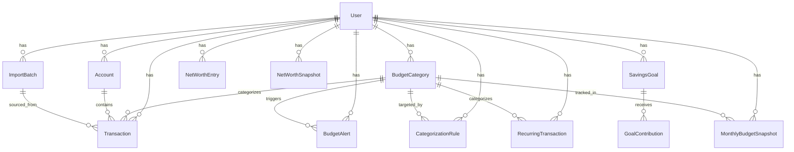

# Data Model

Bamboo Money has 11 Django models organized around users, transactions, budgets, and financial tracking.

## Entity Relationship Diagram



## Model Summary

| Model | Purpose | Key Fields |
|---|---|---|
| **BudgetCategory** | Spending categories with limits | name, icon, color, monthly_limit, rollover_enabled |
| **Account** | Bank accounts / credit cards | name, account_type, institution, balance |
| **Transaction** | Individual financial records | date, description, merchant, amount, is_income |
| **ImportBatch** | CSV import audit trail | filename, source_bank, imported_count |
| **BudgetAlert** | Spending warning notifications | alert_type, message, is_read, month, year |
| **CategorizationRule** | Auto-categorization rules | keyword, match_type, category, priority |
| **RecurringTransaction** | Detected subscriptions | merchant, expected_amount, frequency, next_expected_date |
| **MonthlyBudgetSnapshot** | Budget rollover tracking | base_limit, rollover_in, actual_spent |
| **SavingsGoal** | Savings targets | name, target_amount, current_amount, deadline |
| **GoalContribution** | Goal payment records | amount, date, note |
| **NetWorthEntry** | Manual assets/liabilities | name, entry_type, amount, category |
| **NetWorthSnapshot** | Monthly net worth history | total_assets, total_liabilities, net_worth |

## Core Models

### BudgetCategory

The central organizing model. Every transaction can be assigned to a category, and each category has a monthly spending limit.

```python
class BudgetCategory(models.Model):
    user = ForeignKey(User)
    name = CharField(max_length=100)           # "Food & Dining"
    icon = CharField(max_length=10)             # "🍔"
    color = CharField(max_length=7)             # "#FF9800"
    monthly_limit = DecimalField()              # 600.00
    is_income = BooleanField(default=False)     # Income categories skip budget tracking
    rollover_enabled = BooleanField(default=False)
    rollover_cap = DecimalField(default=0)      # 0 = unlimited

    class Meta:
        unique_together = ["user", "name"]
```

**Computed properties:**

- `spent_this_month()` — queries transactions for current month spending
- `current_rollover()` — looks up previous month's `MonthlyBudgetSnapshot`
- `effective_budget()` — `monthly_limit + current_rollover()`
- `progress_percent()` — `spent / effective_budget × 100`
- `progress_color()` — green (<80%), yellow (80-99%), red (100%+)

### Transaction

The most important model — every financial record flows through here.

```python
class Transaction(models.Model):
    user = ForeignKey(User)
    account = ForeignKey(Account, null=True)          # Optional
    category = ForeignKey(BudgetCategory, null=True)  # Can be uncategorized
    import_batch = ForeignKey(ImportBatch, null=True)  # Null for manual entries
    date = DateField()
    description = CharField(max_length=255)
    merchant = CharField(max_length=200, blank=True)
    amount = DecimalField(max_digits=10, decimal_places=2)  # Always positive
    is_income = BooleanField(default=False)
    notes = TextField(blank=True)

    class Meta:
        ordering = ["-date", "-created_at"]
```

### RecurringTransaction

Detected (or confirmed) recurring charges:

```python
class RecurringTransaction(models.Model):
    user = ForeignKey(User)
    merchant = CharField(max_length=200)
    category = ForeignKey(BudgetCategory, null=True)
    expected_amount = DecimalField()
    frequency = CharField(choices=FREQUENCIES)  # weekly/biweekly/monthly/quarterly/yearly
    next_expected_date = DateField(null=True)
    last_seen_date = DateField(null=True)
    is_confirmed = BooleanField(default=False)  # User-verified
    is_active = BooleanField(default=True)      # Can be paused
```

## Migration History

| # | Migration | Models Created/Modified |
|---|---|---|
| 0001 | `initial` | BudgetCategory, Account, Transaction, SavingsGoal, GoalContribution, NetWorthEntry, NetWorthSnapshot |
| 0002 | `importbatch_transaction_import_batch` | ImportBatch, Transaction.import_batch FK |
| 0003 | `budgetalert` | BudgetAlert |
| 0004 | `categorizationrule` | CategorizationRule |
| 0005 | `recurringtransaction` | RecurringTransaction |
| 0006 | `budgetcategory_rollover_cap_and_more` | BudgetCategory rollover fields, MonthlyBudgetSnapshot |

## User Isolation

All models include a `user = ForeignKey(User)` field, and all views filter by `request.user`. This ensures data isolation between users at the query level.

!!! warning "Known Issue"
    The `transaction_update_category` view validates transaction ownership but **not category ownership**. A user could theoretically assign their transaction to another user's category by guessing the ID. See [Security](security.md) for remediation plan.
