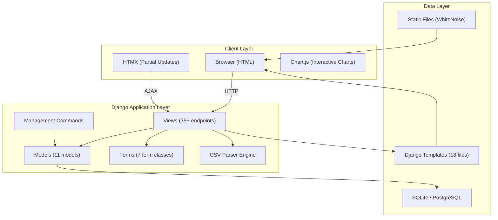

# System Overview

Bamboo Money is a server-rendered Django web application with HTMX for dynamic interactions and Chart.js for data visualization.

## Architecture Diagram



## Request Flow

### Standard Page Load

```
Browser → GET /transactions/ → transaction_list view
  → Query Transaction model (filtered, paginated)
  → Render transactions.html template
  → Return full HTML page
```

### HTMX Partial Update

```
Browser → POST /transactions/42/category/ (HTMX)
  → transaction_update_category view
  → Update Transaction model
  → Render partials/transaction_row.html
  → Return HTML fragment (replaces just that row)
```

### CSV Import Flow

```
Browser → POST /import/ (file upload)
  → csv_upload view → Store in session
  → Redirect to /import/preview/
  → csv_parser.py: detect_bank() + parse_transactions()
  → Render csv_preview.html
  → POST /import/confirm/
  → Create ImportBatch + Transaction records
  → Redirect to /transactions/
```

## Application Structure

Bamboo Money uses a **single Django app** (`interface`) rather than multiple apps:

| Component | Location | Count |
|---|---|---|
| Models | `interface/models.py` | 11 models |
| Views | `interface/views.py` | 35+ views |
| Forms | `interface/forms.py` | 7 form classes |
| URLs | `interface/urls.py` | 40+ URL patterns |
| Templates | `templates/interface/` | 18 templates |
| Partials | `templates/interface/partials/` | 2 HTMX partials |
| Management Commands | `interface/management/commands/` | 3 commands |

!!! info "Single App Decision"
    The original `bamboo_money` design had 6 apps (accounts, statements, transactions, budgets, analytics, advisor). The combined prototype consolidated everything into one `interface` app for faster prototyping. A production version might split back into domain-specific apps.

## Key Design Decisions

| Decision | Rationale |
|---|---|
| **Django 6.0 + server-rendered HTML** | Simplest possible stack — no JS framework needed |
| **HTMX for interactivity** | Inline edits and dynamic updates without a SPA |
| **Chart.js for charts** | Lightweight (60KB), well-documented, dark mode compatible |
| **SQLite for development** | Zero-config, file-based, sufficient for single-user |
| **WhiteNoise for static files** | No Nginx needed in development; production-ready |
| **Bootstrap 5 for UI** | Built-in dark mode, responsive grid, comprehensive components |
| **UV for packages** | Fast installs, deterministic lockfile |
