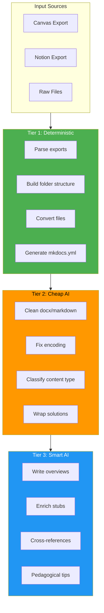

# Three-Tier Processing Model

Chalq's core innovation is a **tiered processing model** that minimizes AI usage (and cost) by doing as much as possible deterministically.

## Overview

## Tier 1: Deterministic (Free, Instant)

**~60% of the work.** Pure Python, no AI, no API calls.

| Task | Input | Output |
|---|---|---|
| Parse Canvas `course-data.js` | JSON | Module tree with items |
| Parse Notion hierarchy | Nested ZIPs + markdown | Page tree with images |
| Build folder structure | Module tree | `docs/modules/week-XX/` |
| Generate `mkdocs.yml` | Module tree | Navigation config |
| Scaffold `pyproject.toml` | Course metadata | Project config |
| Convert `.sql` → markdown | SQL file | Code-fenced markdown |
| Parse `CREATE TABLE` | DDL | Schema reference page |
| Convert `.md` → markdown | Markdown | Cleaned copy |
| Copy/rename attachments | Files | Linked assets |

## Tier 2: Cheap AI / Heuristics (~$0.01, Seconds)

**~25% of the work.** Haiku-class model or regex patterns.

| Task | Input | Method | Output |
|---|---|---|---|
| Clean `.docx` text | Raw extraction | Haiku | Proper markdown |
| Fix encoding artifacts | `’` etc. | Regex | Clean UTF-8 |
| Identify exercise/solution blocks | SQL with comments | Regex + Haiku | Split problems |
| Wrap solutions in collapsibles | Problem blocks | Template | `??? example` admonitions |
| Classify content type | File + context | Haiku | lecture \| lab \| exercise \| ref |
| Extract slide titles from `.pptx` | Slide XML | python-pptx | Page stubs |

## Tier 3: Smart AI (~$0.15/course, 30-60s)

**~15% of the work.** Sonnet/Opus for tasks requiring judgment.

| Task | Input | Model | Output |
|---|---|---|---|
| Write course overview | Module list | Sonnet | `index.md` content |
| Write chapter introductions | Topic name + context | Sonnet | "Why this matters" intros |
| Organize ambiguous content | Unstructured files | Sonnet | Logical page structure |
| Enrich stub pages | Empty/thin content | Sonnet | Conceptual frameworks |
| Generate cross-references | All page titles | Sonnet | Inter-page links |
| Suggest pedagogical improvements | Full wiki | Sonnet | Admonition suggestions |

## Cost Comparison

| Approach | Cost per Course | Speed |
|---|---|---|
| Send everything to Opus | $2–4 | 5–10 min |
| Send everything to Sonnet | $1–2 | 3–5 min |
| **Chalq three-tier** | **~$0.16** | **< 2 min** |
| No AI (Tier 1 only) | $0.00 | Seconds |

The three-tier model is **10–25x cheaper** than naive AI approaches because it only uses expensive models for tasks that genuinely need judgment.
