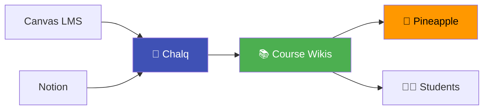

# Vision

## The Big Idea

Every university course has content trapped in an LMS. Canvas, Blackboard, Moodle — they all have the same problem: content is locked behind login walls, poorly searchable, and ugly.

**Chalq turns course content into public, beautiful, searchable wikis.**

## Who Is This For?

| Persona | Need |
|---|---|
| **Professors** | Publish course materials as professional documentation |
| **Students** | Access course content in a searchable, modern interface |
| **Teaching Assistants** | Contribute fixes and additions via pull requests |
| **Future students** | Preview course content before enrolling |
| **AI tools** | Consume structured course content (e.g., Pineapple course assistant) |

## Design Philosophy

!!! quote "Fantastic documentation before building anything"
    Chalq's own development follows this principle. The full product spec was written before a single line of CLI code.

### Why Not Just Use AI?

You *could* send every course file to GPT-4o and ask it to make a wiki. Problems:

1. **Expensive** — $2-4 per course, $200+ for a department
2. **Slow** — 5-10 minutes of API calls
3. **Inconsistent** — different runs produce different structures
4. **Wasteful** — 60% of the work is mechanical (parsing, structuring, scaffolding)

Chalq uses AI **only where it adds value** — judgment calls, creative writing, quality enrichment. The mechanical work is deterministic Python.

## Relationship to Other Projects

- **Chalq** converts course materials into wikis
- **Course Wikis** are the published output (public GitHub Pages)
- **Pineapple** (future) is an AI course assistant that consumes wiki content
