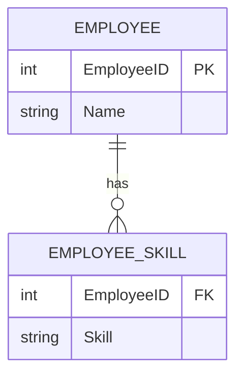

# Managing Attributes

!!! info "ERD Guide — Part 4 of 6"
    Types of attributes and how to represent them in ER diagrams.

## Adding Attributes to Entities

In a diagram tool like draw.io or Visio, attributes appear as **rows inside the entity box**:

```
┌──────────────────────────────────┐
│            CUSTOMERS             │
├──────────────────────────────────┤
│ CustomerID            (PK)       │
│ Customer_Name         char(50)   │
│ Customer_Address      varchar(50)│
└──────────────────────────────────┘
```

Most attributes follow this straightforward format. But there are some special types to watch for.

---

## 1. Identifiers (Primary Keys)

The attribute (or set of attributes) that **uniquely identifies** each instance of an entity.

```
┌──────────────────────────────────┐
│            CUSTOMERS             │
├──────────────────────────────────┤
│ CustomerID            (PK)  🔑  │
│ Customer_Name         NOT NULL   │
│ Customer_Address                 │
└──────────────────────────────────┘
```

**Rules for identifiers:**

- Must be **unique** — no two instances share the same value
- Must be **non-null** — every instance must have a value
- Should be **stable** — ideally doesn't change over time
- Can be **natural** (SSN, ISBN) or **surrogate** (auto-generated ID)

---

## 2. Composite Attributes

An attribute that can be **broken down into smaller, meaningful parts**.

```
┌──────────────────────────────────────────┐
│              CUSTOMERS                    │
├──────────────────────────────────────────┤
│ CustomerID                (PK)            │
│ Customer_Name             char(50)        │
│ Customer_Address          varchar(50)     │
│   ├── Street_Address                      │
│   ├── City                                │
│   ├── State                               │
│   └── Postal_Code                         │
└──────────────────────────────────────────┘
```

> **Example:** An address is composed of Street Address, City, State, and Postal Code. You might store them together or separately depending on whether you need to query individual components.

!!! tip "When to Decompose"
    Break a composite attribute into parts when you need to **search, sort, or filter** by the individual components. If you never need "just the city," storing the full address as one field is fine.

---

## 3. Multivalued Attributes

An attribute that can have **multiple values** for a single entity instance.

```
┌──────────────────────────────────────────┐
│              EMPLOYEE                     │
├──────────────────────────────────────────┤
│ EmployeeID                (PK)            │
│ Employee_Name             NOT NULL        │
│ Employee_Address          varchar(50)     │
│ {Skills}                  ← multivalued   │
└──────────────────────────────────────────┘
```

> **Example:** An employee can have multiple skills (Python, SQL, Java). The curly braces `{ }` indicate a multivalued attribute.

**How to handle in implementation:**

Multivalued attributes are typically resolved by creating a **separate table**:



---

## 4. Derived Attributes

An attribute whose value can be **calculated** from other attributes.

```
┌──────────────────────────────────────────┐
│              EMPLOYEE                     │
├──────────────────────────────────────────┤
│ EmployeeID                (PK)            │
│ Date_of_Birth                             │
│ /Age/                     ← derived       │
└──────────────────────────────────────────┘
```

> **Example:** Age can be derived from Date_of_Birth and the current date. It doesn't need to be stored — it can be computed on the fly.

**Notation:** Derived attributes are shown with a forward slash `/Age/` or dashed underline.

!!! note "To Store or Not to Store?"
    Derived attributes are generally **not stored** in the database — they're calculated when needed. However, for performance reasons (complex calculations, frequently accessed), you might choose to store and periodically update them.

---

## Attribute Summary

| Type | Symbol | Example | Storage |
|------|--------|---------|---------|
| **Simple** | Regular row | Customer_Name | Stored directly |
| **Identifier (PK)** | 🔑 or underlined | CustomerID | Stored, indexed, unique |
| **Composite** | Indented sub-attributes | Address → Street, City, State, Zip | Stored together or separately |
| **Multivalued** | `{ }` curly braces | {Skills}, {Phone Numbers} | Separate table |
| **Derived** | `/ /` or dashed | /Age/, /Total/ | Usually computed, not stored |

---

*[← Special Entity Types](erd-guide-entity-types.md) | [Next: Enhanced ERD (EERD) →](erd-guide-eerd.md)*
