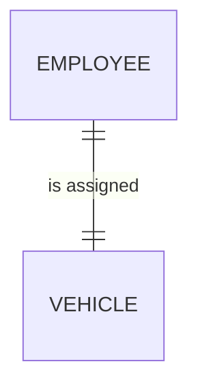
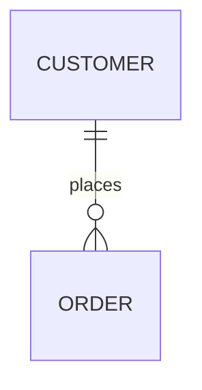
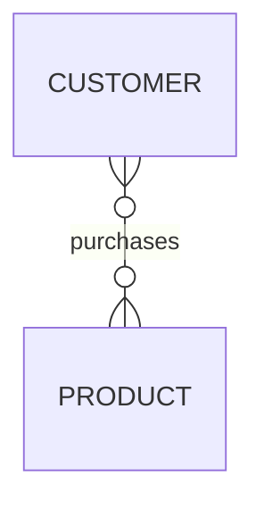
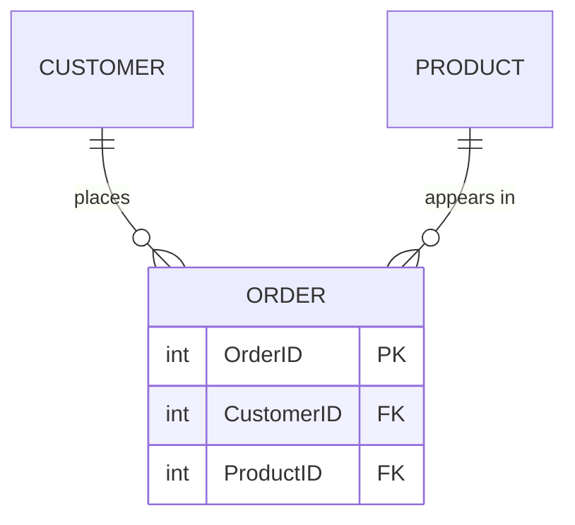
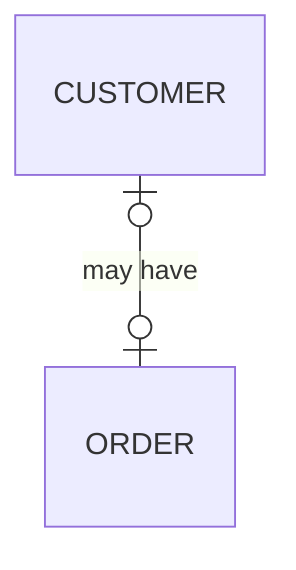
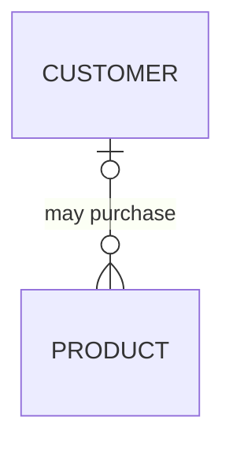
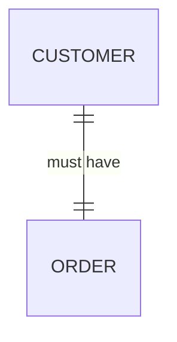

# Cardinality in Entity-Relationship Diagrams

!!! info "ERD Guide — Part 1 of 6"
    Understanding how entities relate to each other through cardinality.

## What is Cardinality?

Cardinality describes **how one instance of an entity relates to instances of another entity.** It answers the question:

> "One instance of **Entity A** relates to **how many** instances of **Entity B**?"

We explore the cardinality between entities **in both directions**, one direction at a time:

- From A → B: "One instance of A relates to ___ instance(s) of B"
- From B → A: "One instance of B relates to ___ instance(s) of A"

---

## Maximum Cardinality: The Three Basic Types

### 1. One-to-One (1:1)

One instance of the first entity relates to **exactly one** instance of the second entity.

> **Example:** One employee is assigned one company vehicle. One vehicle is assigned to one employee.

### 2. One-to-Many (1:M)

One instance of the first entity relates to **many** instances of the second entity.

> **Example:** One customer can place many orders. But each order belongs to only one customer.

### 3. Many-to-Many (M:M)

Many instances of the first entity relate to **many** instances of the second entity.

> **Example:** One customer can purchase many products. One product can be purchased by many customers.

---

## Resolving Many-to-Many Relationships

!!! warning "Important"
    Many-to-Many relationships are typically **resolved** by creating a new table that captures the matches between the two original tables.

The M:M relationship between CUSTOMER and PRODUCT becomes:

The new **ORDER** table sits between CUSTOMER and PRODUCT, turning one M:M into two 1:M relationships.

---

## Minimum Cardinality: Optional vs. Mandatory

Beyond maximum cardinality (one or many), we also specify whether a relationship is **required** or **optional**.

### Optional Relationships (Minimum = 0)

An instance of one entity **may or may not** be related to an instance of the other.

#### Optional One-to-One (0..1)

> A customer **may or may not** have an order.

#### Optional One-to-Many (0..M)

> A customer **may or may not** have purchased any products. (Zero or many.)

### Mandatory Relationships (Minimum = 1)

An instance of one entity **must** be related to at least one instance of the other.

#### Mandatory One-to-One (1..1)

> Every customer **must** have at least one order. (Perhaps they're only added to the system when they place an order.)

#### Mandatory One-to-Many (1..M)

> Every customer **must** have purchased at least one product.

---

## Notation Summary

| Symbol | Meaning |
|--------|---------|
| `||` | Exactly one (mandatory) |
| `|o` | Zero or one (optional) |
| `|{` | One or many (mandatory) |
| `o{` | Zero or many (optional) |

---

## How to Determine Cardinality

Follow this process for any two entities:

1. **Pick a direction** — start with Entity A → Entity B
2. **Ask:** "Can ONE instance of A relate to ONE or MANY instances of B?"
3. **Ask:** "Is the relationship MANDATORY or OPTIONAL?"
4. **Repeat** in the other direction (B → A)
5. **Combine** both sides to get the full cardinality notation

!!! tip "Practice Tip"
    Always think about **specific instances**, not the entities in general. Ask: "Can this ONE specific customer have many orders?" not "Can customers have orders?"

---

*[← Back to Course Home](../index.md) | [Next: Degrees of Relationship →](erd-guide-degrees.md)*
