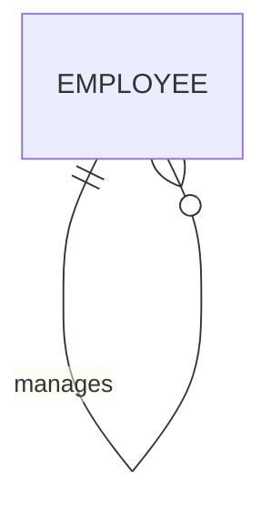
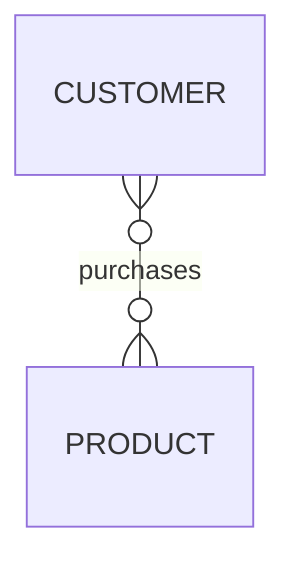
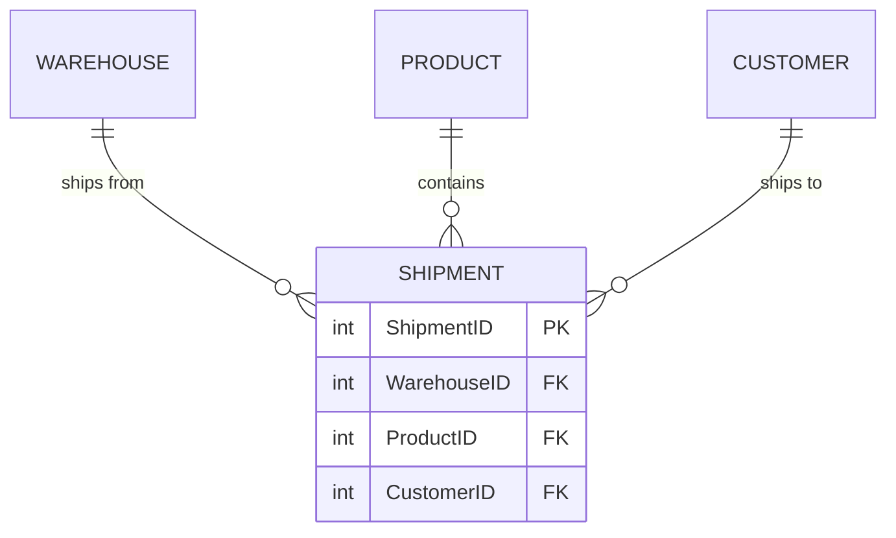

# Degrees of Relationship

!!! info "ERD Guide — Part 2 of 6"
    The number of entity types that participate in a relationship.

## What is a Degree?

The **degree** of a relationship refers to **how many entity types participate** in that relationship.

---

## 1. Unary Relationship (Degree 1)

Only **one** entity type is involved — the entity relates to **itself**.

> **Example:** An employee manages other employees. The "manages" relationship involves only the EMPLOYEE entity.

**Common unary relationships:**

| Entity | Relationship | Description |
|--------|-------------|-------------|
| EMPLOYEE | manages / is managed by | Supervisor hierarchy |
| PERSON | is married to | Marriage |
| PART | contains | Bill of materials |

!!! note
    Unary relationships can also be **many-to-many**! Think of a parts hierarchy where one part contains many sub-parts, and one sub-part can be used in many parent parts.

---

## 2. Binary Relationship (Degree 2)

**Two** entity types participate in the relationship. This is the **most common** type.

> **Example:** Customers purchase products. Two entities involved: CUSTOMER and PRODUCT.

---

## 3. Ternary Relationship (Degree 3)

**Three** entity types participate in a single relationship.

> **Example:** A shipment involves a WAREHOUSE (where it ships from), a PRODUCT (what is shipped), and a CUSTOMER (who receives it). All three are needed to describe the relationship.

---

## 4. N-ary Relationship (Degree 4+)

Any relationship involving **more than three** entity types. These are rare in practice and are usually decomposed into simpler relationships.

---

## Summary

| Degree | Name | Entities Involved | Example |
|--------|------|-------------------|---------|
| 1 | Unary | 1 (self-referencing) | Employee manages Employee |
| 2 | Binary | 2 | Customer purchases Product |
| 3 | Ternary | 3 | Warehouse ships Product to Customer |
| 4+ | N-ary | 4+ | Rare — usually decomposed |

!!! tip "Design Tip"
    When you encounter a ternary or higher relationship, ask yourself: "Can I break this into multiple binary relationships?" Often you can, and it simplifies the model.

---

*[← Cardinalities](erd-guide-cardinalities.md) | [Next: Special Entity Types →](erd-guide-entity-types.md)*
