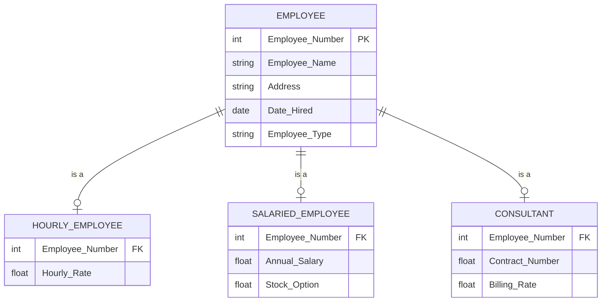

# Enhanced Entity-Relationship Diagrams (EERD)

!!! info "ERD Guide — Part 5 of 6"
    Extending ER diagrams with supertypes, subtypes, and specialization.

## What is an EERD?

An **Enhanced Entity-Relationship Diagram** extends the standard ERD by adding support for **categories and subcategories** within entities — essentially, inheritance in database design.

---

## Supertypes and Subtypes

A **supertype** is a general entity that can be divided into more specific **subtypes**.



### How It Works

- **Supertype (EMPLOYEE):** Contains attributes shared by ALL employees (name, address, date hired)
- **Subtypes (HOURLY, SALARIED, CONSULTANT):** Contain attributes specific to that type only
- **Inheritance:** Each subtype inherits all attributes from the supertype

---

## Subtype Discriminator

The **discriminator** is an attribute in the supertype that determines which subtype an instance belongs to.

```
EMPLOYEE
├── Employee_Number (PK)
├── Employee_Name
├── Address
├── Date_Hired
└── Employee_Type ← DISCRIMINATOR
    ├── "H" → HOURLY_EMPLOYEE
    ├── "S" → SALARIED_EMPLOYEE
    └── "C" → CONSULTANT
```

> The value of `Employee_Type` tells you which subtype table to look in for additional attributes.

---

## Completeness Constraints

Can an instance of the supertype exist **without** belonging to any subtype?

### Total Specialization

Every supertype instance **must** belong to at least one subtype.

> **Example:** Every EMPLOYEE must be either Hourly, Salaried, or Consultant. No "unclassified" employees allowed.

**Notation:** Double line connecting supertype to the specialization circle.

### Partial Specialization

A supertype instance **may or may not** belong to a subtype.

> **Example:** A VEHICLE may be classified as CAR, TRUCK, or MOTORCYCLE — but some vehicles might not fit any category yet.

**Notation:** Single line connecting supertype to the specialization circle.

---

## Disjointness Constraints

Can an instance belong to **more than one** subtype?

### Disjoint (Exclusive)

An instance can belong to **only one** subtype.

> **Example:** An employee is either Hourly OR Salaried OR Consultant — never two at once.

**Notation:** "d" in the specialization circle.

### Overlapping (Inclusive)

An instance can belong to **multiple** subtypes simultaneously.

> **Example:** A PERSON can be both a STUDENT and an EMPLOYEE at the same time.

**Notation:** "o" in the specialization circle.

---

## Constraint Combinations

| Completeness | Disjointness | Meaning |
|-------------|-------------|---------|
| **Total + Disjoint** | Every instance must be in exactly one subtype | Most restrictive |
| **Total + Overlapping** | Every instance must be in at least one subtype (can be multiple) | |
| **Partial + Disjoint** | Instance may or may not be in a subtype; if it is, only one | |
| **Partial + Overlapping** | Instance may be in zero, one, or many subtypes | Most flexible |

---

## When to Use EERD

!!! tip "Use supertypes/subtypes when:"
    - Different categories of an entity have **different attributes**
    - Different categories participate in **different relationships**
    - You want to enforce **business rules** about categories
    - There are **shared attributes** (supertype) and **specific attributes** (subtypes)

!!! warning "Avoid when:"
    - The categories only differ in the **value** of an attribute (use a simple column instead)
    - There are only 1-2 extra attributes per subtype (might not be worth the complexity)

---

*[← Managing Attributes](erd-guide-attributes.md) | [Next: Relational Model →](erd-guide-relational-model.md)*
