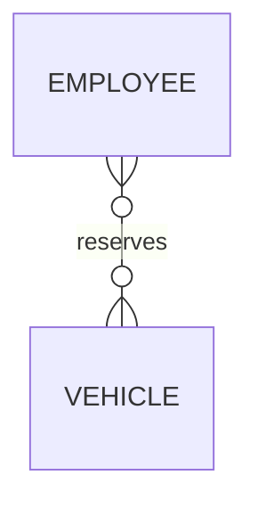
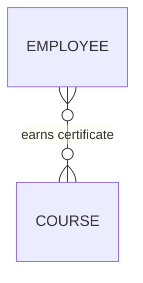
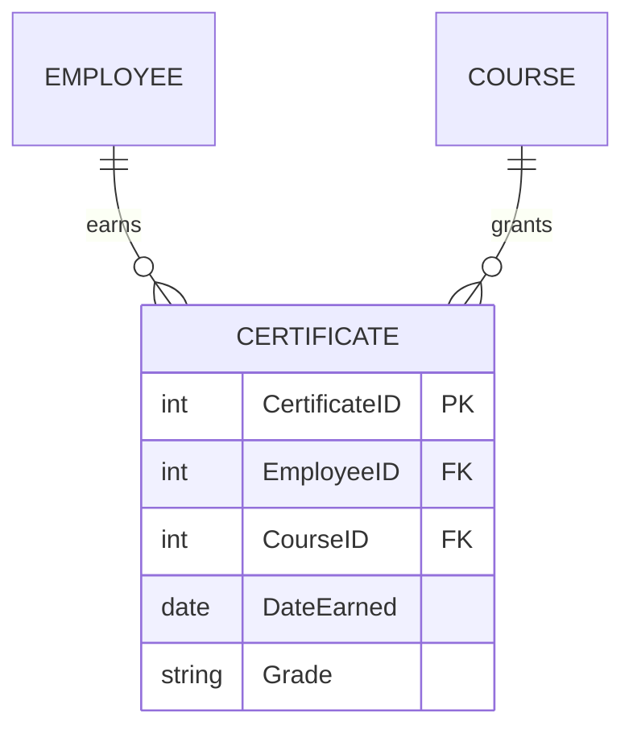
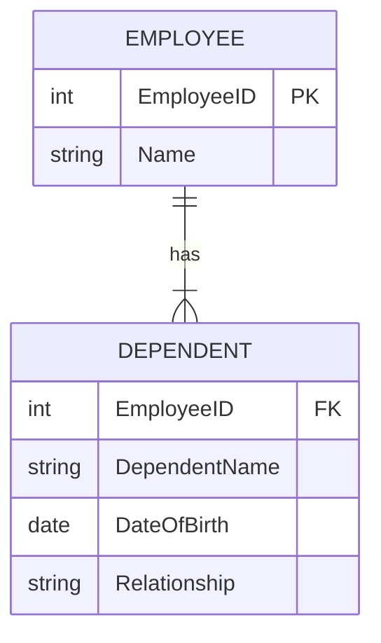

# Special Entity Types

!!! info "ERD Guide — Part 3 of 6"
    Relationships with attributes, associative entities, and weak entities.

## 1. Relationships with Attributes

Sometimes a relationship itself has attributes that don't belong to either entity alone.

> When an EMPLOYEE reserves a VEHICLE, the **Date_Reserved** doesn't belong to the employee or the vehicle — it belongs to the *relationship* between them.

**How to show this:** Place attributes on the relationship line in your ER diagram. In draw.io, these appear as labels on the connecting line.

---

## 2. Associative Entities

When a relationship has its own attributes, we often promote it to an **associative entity** — a full entity that represents the relationship.

### Before (Relationship with Attributes)

The relationship carries: Certificate details, date earned, etc.

### After (Associative Entity)

> **CERTIFICATE** is now its own entity — it captures the relationship between EMPLOYEE and COURSE, plus has its own attributes.

!!! tip "When to Use Associative Entities"
    - When a M:M relationship has attributes
    - When you need to track **when** or **how** two things are related
    - When the relationship itself could have relationships to other entities

---

## 3. Weak Entities

A **weak entity** cannot exist without its parent (or "strong") entity. It does not have a meaningful primary key on its own.

> A **DEPENDENT** (spouse, child) cannot exist in the database without being linked to an EMPLOYEE. If the employee record is deleted, the dependent records should also be removed.

### Characteristics of Weak Entities

| Property | Weak Entity | Regular Entity |
|----------|-------------|----------------|
| **Exists independently?** | No — depends on parent | Yes |
| **Has its own PK?** | Partial key only (needs parent's PK) | Yes |
| **Deletion behavior** | Deleted when parent is deleted | Independent |
| **Notation** | Double-bordered rectangle (in some notations) | Single-bordered rectangle |

!!! warning "Key Point"
    A weak entity's primary key is typically a **composite key** — the parent's primary key combined with a partial key that's unique only within that parent.

    Example: DEPENDENT's PK = (EmployeeID, DependentName)

---

## Summary

| Concept | What It Is | When to Use |
|---------|-----------|-------------|
| **Relationship Attributes** | Attributes that belong to the relationship, not either entity | When the relationship itself has data (dates, quantities, etc.) |
| **Associative Entity** | A relationship promoted to a full entity | M:M relationships with attributes, or when the relationship needs its own relationships |
| **Weak Entity** | An entity that can't exist without its parent | Child records that are meaningless without a parent (dependents, order line items, etc.) |

---

*[← Degrees of Relationship](erd-guide-degrees.md) | [Next: Managing Attributes →](erd-guide-attributes.md)*
