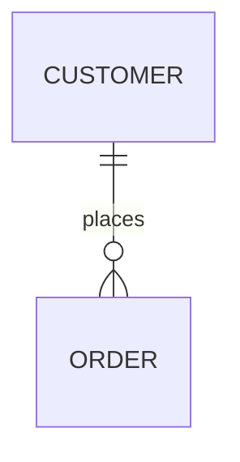
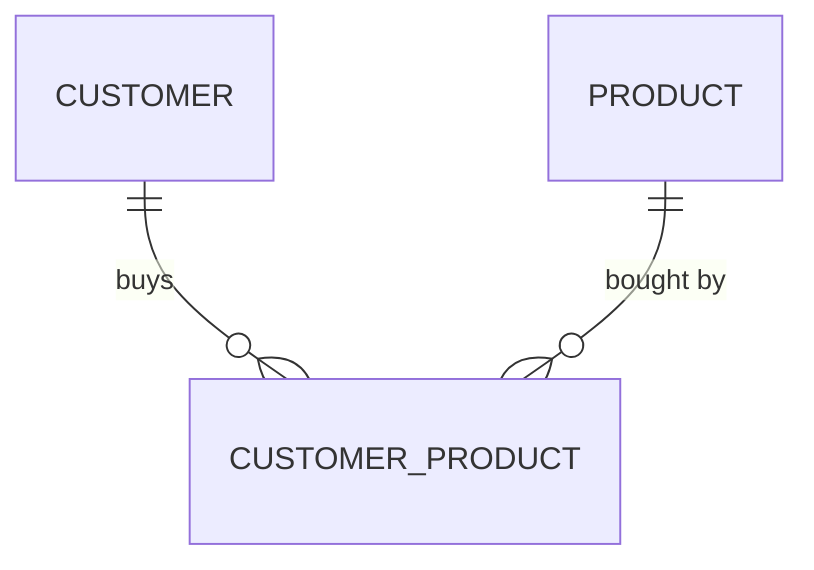

# Relational Model — Logical Database Design

!!! info "ERD Guide — Part 6 of 6"
    Mapping your conceptual ERD to a logical relational model.

## What is the Relational Model?

The **relational model** (also called the logical model) is the step where you convert your conceptual ER diagram into **actual tables with columns, primary keys, and foreign keys**. This is what you'll eventually implement in a database.

There are **7 mapping rules** to follow:

---

## Rule 1: Map Regular Entities → Tables

Each entity becomes a table. Each attribute becomes a column. The identifier becomes the primary key.

```sql
-- Entity: CUSTOMER (CustomerID, Name, Address)
CREATE TABLE Customer (
    CustomerID  INT PRIMARY KEY,
    Name        VARCHAR(50) NOT NULL,
    Address     VARCHAR(100)
);
```

---

## Rule 2: Map Weak Entities

A weak entity becomes a table with a **composite primary key** — the parent's PK + the weak entity's partial key.

```sql
-- Weak entity: DEPENDENT depends on EMPLOYEE
CREATE TABLE Dependent (
    EmployeeID      INT,
    DependentName   VARCHAR(50),
    DateOfBirth     DATE,
    Relationship    VARCHAR(20),
    PRIMARY KEY (EmployeeID, DependentName),
    FOREIGN KEY (EmployeeID) REFERENCES Employee(EmployeeID)
        ON DELETE CASCADE
);
```

> Note the `ON DELETE CASCADE` — when an employee is deleted, their dependents are automatically removed.

---

## Rule 3: Map Binary Relationships

### One-to-Many (1:M)

The primary key from the **"one" side** is added as a **foreign key** in the table on the **"many" side**.



```sql
CREATE TABLE Customer (
    CustomerID  INT PRIMARY KEY,
    Name        VARCHAR(50)
);

CREATE TABLE Order_ (
    OrderID     INT PRIMARY KEY,
    OrderDate   DATE,
    CustomerID  INT,  -- FK from the "one" side
    FOREIGN KEY (CustomerID) REFERENCES Customer(CustomerID)
);
```

### Many-to-Many (M:M)

Create a **new table** between the two original tables. Include the primary keys of both as foreign keys (together they form the composite PK).



```sql
CREATE TABLE Customer_Product (
    CustomerID  INT,
    ProductID   INT,
    Quantity    INT,
    PRIMARY KEY (CustomerID, ProductID),
    FOREIGN KEY (CustomerID) REFERENCES Customer(CustomerID),
    FOREIGN KEY (ProductID) REFERENCES Product(ProductID)
);
```

### One-to-One (1:1)

The primary key from the **mandatory side** is copied into the **optional side** as a foreign key.

```sql
-- If EMPLOYEE must have a PARKING_SPOT (mandatory), 
-- but PARKING_SPOT may or may not be assigned (optional):
CREATE TABLE ParkingSpot (
    SpotID      INT PRIMARY KEY,
    Location    VARCHAR(20),
    EmployeeID  INT UNIQUE,  -- FK + UNIQUE = enforces 1:1
    FOREIGN KEY (EmployeeID) REFERENCES Employee(EmployeeID)
);
```

---

## Rule 4: Map Associative Entities

An associative entity maps just like a M:M relationship — it gets its own table with foreign keys to both parent tables, plus its own attributes.

```sql
-- CERTIFICATE is an associative entity between EMPLOYEE and COURSE
CREATE TABLE Certificate (
    EmployeeID      INT,
    CourseID        INT,
    DateEarned      DATE,
    Grade           CHAR(2),
    PRIMARY KEY (EmployeeID, CourseID),
    FOREIGN KEY (EmployeeID) REFERENCES Employee(EmployeeID),
    FOREIGN KEY (CourseID) REFERENCES Course(CourseID)
);
```

**Alternative:** If the associative entity can have multiple instances for the same pair (e.g., an employee takes the same course twice), add a surrogate PK:

```sql
CREATE TABLE Certificate (
    CertificateID   INT PRIMARY KEY,
    EmployeeID      INT,
    CourseID        INT,
    DateEarned      DATE,
    Grade           CHAR(2),
    FOREIGN KEY (EmployeeID) REFERENCES Employee(EmployeeID),
    FOREIGN KEY (CourseID) REFERENCES Course(CourseID)
);
```

---

## Rule 5: Map Unary Relationships

### One-to-Many (Self-Referencing)

Add a **recursive foreign key** in the same table.

```sql
-- EMPLOYEE manages other EMPLOYEEs
CREATE TABLE Employee (
    EmployeeID  INT PRIMARY KEY,
    Name        VARCHAR(50),
    ManagerID   INT,  -- FK referencing the same table
    FOREIGN KEY (ManagerID) REFERENCES Employee(EmployeeID)
);
```

### Many-to-Many (Self-Referencing)

Create a **separate table** with two foreign keys pointing to the same entity.

```sql
-- PART contains other PARTs (bill of materials)
CREATE TABLE Part_Structure (
    ParentPartID    INT,
    ChildPartID     INT,
    Quantity        INT,
    PRIMARY KEY (ParentPartID, ChildPartID),
    FOREIGN KEY (ParentPartID) REFERENCES Part(PartID),
    FOREIGN KEY (ChildPartID) REFERENCES Part(PartID)
);
```

---

## Rule 6: Map Ternary Relationships

Add **one table for each entity** and **one table for the associative entity**. The associative entity keeps a foreign key for each related table.

```sql
-- Ternary: WAREHOUSE ships PRODUCT to CUSTOMER
CREATE TABLE Shipment (
    ShipmentID      INT PRIMARY KEY,
    WarehouseID     INT,
    ProductID       INT,
    CustomerID      INT,
    ShipDate        DATE,
    Quantity        INT,
    FOREIGN KEY (WarehouseID) REFERENCES Warehouse(WarehouseID),
    FOREIGN KEY (ProductID) REFERENCES Product(ProductID),
    FOREIGN KEY (CustomerID) REFERENCES Customer(CustomerID)
);
```

---

## Rule 7: Map Supertypes and Subtypes

Create **one table for the supertype** and **one table for each subtype**. Subtypes share the supertype's primary key.

```sql
-- Supertype
CREATE TABLE Employee (
    EmployeeID      INT PRIMARY KEY,
    Name            VARCHAR(50),
    Address         VARCHAR(100),
    DateHired       DATE,
    EmployeeType    CHAR(1)  -- Discriminator: 'H', 'S', 'C'
);

-- Subtypes
CREATE TABLE HourlyEmployee (
    EmployeeID  INT PRIMARY KEY,
    HourlyRate  DECIMAL(8,2),
    FOREIGN KEY (EmployeeID) REFERENCES Employee(EmployeeID)
);

CREATE TABLE SalariedEmployee (
    EmployeeID      INT PRIMARY KEY,
    AnnualSalary    DECIMAL(10,2),
    StockOption     DECIMAL(10,2),
    FOREIGN KEY (EmployeeID) REFERENCES Employee(EmployeeID)
);

CREATE TABLE Consultant (
    EmployeeID      INT PRIMARY KEY,
    ContractNumber  VARCHAR(20),
    BillingRate     DECIMAL(8,2),
    FOREIGN KEY (EmployeeID) REFERENCES Employee(EmployeeID)
);
```

---

## Quick Reference: All 7 Mapping Rules

| # | What to Map | How |
|---|------------|-----|
| 1 | Regular entities | Entity → Table, attributes → columns, identifier → PK |
| 2 | Weak entities | Composite PK (parent PK + partial key), CASCADE delete |
| 3 | Binary relationships | 1:M → FK on many side; M:M → new table; 1:1 → FK on optional side |
| 4 | Associative entities | Own table with FKs to both parents + own attributes |
| 5 | Unary relationships | 1:M → recursive FK; M:M → separate junction table |
| 6 | Ternary relationships | One table per entity + one associative table with all FKs |
| 7 | Supertypes/subtypes | One table for supertype + one per subtype sharing the PK |

---

*[← Enhanced ERD (EERD)](erd-guide-eerd.md) | [Next: IS380 ERD Example →](is380-erd-example.md)*
