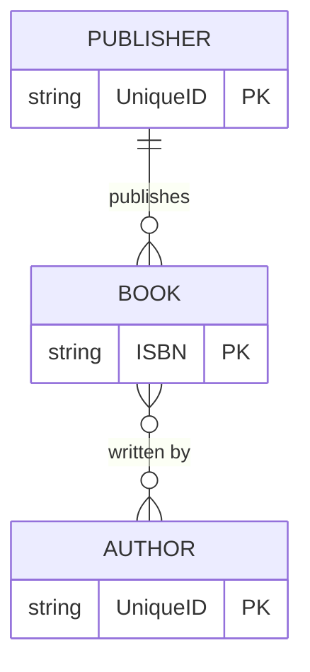
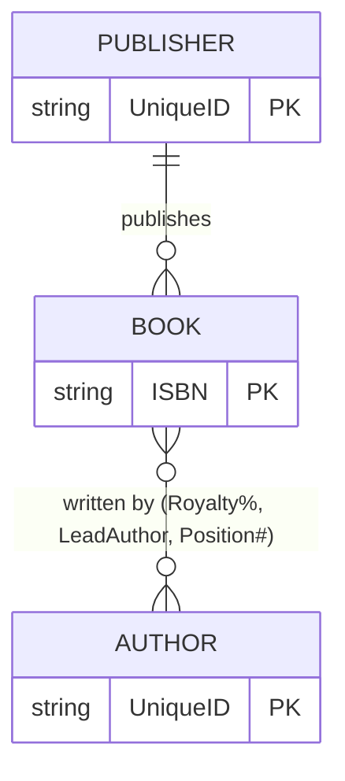
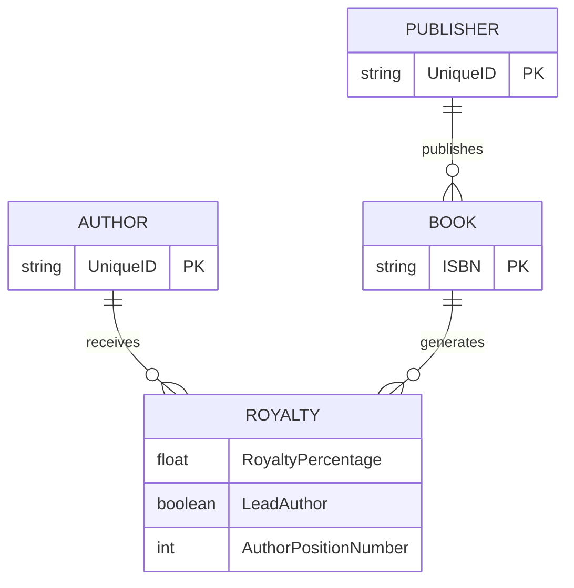
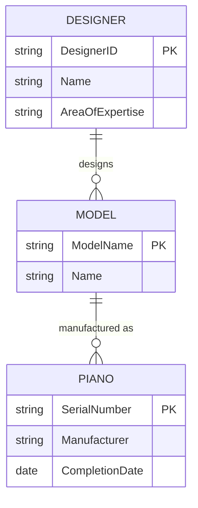

# IS380 ERD Examples — Books & Pianos

!!! example "Practical Examples"
    Applying ER modeling concepts to real-world scenarios from IS380.

## Part 1A: Books, Authors & Publishers

### The Scenario

A publishing company needs to track **books**, **authors**, and **publishers**. Key business rules:

- A book can have **many authors**, and an author can write **many books** (M:M)
- Each book is published by **exactly one publisher**, but a publisher can publish **many books** (1:M mandatory)
- When an author writes a book, we need to track: **royalty percentage**, whether they're the **lead author**, and their **author position number**

### Conceptual ERD



### The Problem: Relationship Attributes

The M:M relationship between BOOK and AUTHOR has attributes (royalty %, lead author, position #). We have two options:

---

### Option 1: Associative Attributes

Place the attributes directly on the relationship line. This works conceptually but can be hard to implement.



### Option 2: Associative Entity (Recommended)

Create a **ROYALTY** entity that captures the relationship and its attributes:



!!! success "Why Option 2 is Better"
    - The ROYALTY entity can have its **own primary key**
    - It can participate in **other relationships** if needed
    - It maps cleanly to a **physical table** in the database
    - It's easier to **query**: "Show me all royalties for Author X"

### Logical Model (SQL)

```sql
CREATE TABLE Publisher (
    PublisherID  VARCHAR(20) PRIMARY KEY,
    Name         VARCHAR(100)
);

CREATE TABLE Book (
    ISBN         VARCHAR(13) PRIMARY KEY,
    Title        VARCHAR(200),
    PublisherID  VARCHAR(20) NOT NULL,
    FOREIGN KEY (PublisherID) REFERENCES Publisher(PublisherID)
);

CREATE TABLE Author (
    AuthorID     VARCHAR(20) PRIMARY KEY,
    Name         VARCHAR(100)
);

CREATE TABLE Royalty (
    AuthorID            VARCHAR(20),
    ISBN                VARCHAR(13),
    RoyaltyPercentage   DECIMAL(5,2),
    LeadAuthor          BOOLEAN,
    AuthorPositionNum   INT,
    PRIMARY KEY (AuthorID, ISBN),
    FOREIGN KEY (AuthorID) REFERENCES Author(AuthorID),
    FOREIGN KEY (ISBN) REFERENCES Book(ISBN)
);
```

---

## Part 1B: Pianos, Models & Designers

### The Scenario

A piano manufacturing company needs to track **pianos**, **piano models**, and **designers**:

- A designer creates **many models**, but each model has **one designer** (1:M)
- A model can have **many pianos** manufactured, each piano is of **one model** (1:M)

### Conceptual ERD



### Logical Model (SQL)

```sql
CREATE TABLE Designer (
    DesignerID      VARCHAR(20) PRIMARY KEY,
    Name            VARCHAR(100),
    AreaOfExpertise VARCHAR(50)
);

CREATE TABLE Model (
    ModelName   VARCHAR(50) PRIMARY KEY,
    Name        VARCHAR(100),
    DesignerID  VARCHAR(20) NOT NULL,
    FOREIGN KEY (DesignerID) REFERENCES Designer(DesignerID)
);

CREATE TABLE Piano (
    SerialNumber    VARCHAR(30) PRIMARY KEY,
    Manufacturer    VARCHAR(100),
    CompletionDate  DATE,
    ModelName       VARCHAR(50) NOT NULL,
    FOREIGN KEY (ModelName) REFERENCES Model(ModelName)
);
```

---

## Key Takeaways

| Concept Applied | Example |
|----------------|---------|
| **M:M resolved with associative entity** | AUTHOR ↔ BOOK → ROYALTY |
| **1:M with mandatory relationship** | PUBLISHER → BOOK (every book needs a publisher) |
| **Relationship attributes** | Royalty %, Lead Author, Position # |
| **Chain of 1:M relationships** | DESIGNER → MODEL → PIANO |
| **FK placement rule** | FK always goes on the "many" side |

---

*[← Relational Model](erd-guide-relational-model.md) | [Back to Course Home →](../index.md)*
