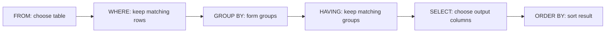

# SQL Foundations

SQL query writing starts with one question: **what rows do I need, and what columns should appear in the final result?**

## Key Definitions

| Term | Meaning |
|---|---|
| `SELECT` | Chooses the columns and calculated values shown in the output. |
| `FROM` | Identifies the source table or joined tables. |
| `WHERE` | Filters individual rows before grouping. |
| `GROUP BY` | Combines rows into groups so aggregates can be calculated per group. |
| `HAVING` | Filters groups after aggregation. |
| `ORDER BY` | Sorts the final result. |
| Aggregate function | A function such as `COUNT`, `SUM`, `AVG`, `MIN`, or `MAX` that summarizes multiple rows. |

## Mental Model



## Common Mistakes

- Using `WHERE` with an aggregate condition such as `COUNT(*) > 3`.
- Forgetting that non-aggregate columns usually belong in `GROUP BY`.
- Thinking the written order is the same as the logical processing order.
- Forgetting that `COUNT(column)` ignores `NULL`, while `COUNT(*)` counts rows.

!!! tip "Video: GROUP BY vs HAVING"
    <video controls preload="metadata" width="100%">
      <source src="../../assets/videos/sql_group_by_having.mp4" type="video/mp4">
      Your browser does not support the video tag.
    </video>


## Compact Guide Section

# 1. SQL Foundations

## 1.1 What SQL Is For

SQL is the language used to define, change, and query data in relational databases.

Common categories:

| Category | Purpose | Examples |
|---|---|---|
| DDL: Data Definition Language | Define database structures | `CREATE TABLE`, `ALTER TABLE`, `CREATE VIEW` |
| DML: Data Manipulation Language | Work with stored data | `SELECT`, `INSERT`, `UPDATE`, `DELETE` |
| DCL: Data Control Language | Control access | `GRANT`, `REVOKE` |

For this guide, the most important statement is `SELECT`.

## 1.2 Basic SELECT Syntax Map

Typical written order:

```sql
SELECT column_list
FROM table_name
WHERE row_condition
GROUP BY grouping_column
HAVING group_condition
ORDER BY sort_column;
```

Logical processing order:

1. `FROM`: identify the table or joined tables.
2. `WHERE`: filter individual rows.
3. `GROUP BY`: group rows into categories.
4. `HAVING`: filter groups.
5. `SELECT`: choose and calculate output columns.
6. `ORDER BY`: sort the final result.

This is why a column alias created in `SELECT` usually cannot be used in `WHERE`: the `WHERE` step happens earlier.

## 1.3 Filtering Rows With WHERE

Use `WHERE` when you want to keep or remove individual rows before grouping.

```sql
SELECT product_id, product_name, price
FROM products
WHERE price >= 100;
```

Boolean logic:

```sql
SELECT product_id, product_name, price
FROM products
WHERE price >= 100
  AND category_id = 10;
```

Parentheses matter:

```sql
SELECT product_id, product_name, price, category_id
FROM products
WHERE category_id = 10
  AND (price >= 100 OR price IS NULL);
```

## 1.4 Calculated Columns and Aliases

Calculated columns are created in the `SELECT` clause.

```sql
SELECT
  product_id,
  product_name,
  price,
  price * 1.10 AS price_with_markup
FROM products;
```

Aliases make output columns readable. They also make complex queries easier to grade and understand.

## 1.5 Aggregate Functions

Common aggregate functions:

| Function | Meaning |
|---|---|
| `COUNT(*)` | Count rows. |
| `COUNT(column)` | Count non-null values in a column. |
| `SUM(column)` | Add values. |
| `AVG(column)` | Average values. |
| `MIN(column)` | Smallest value. |
| `MAX(column)` | Largest value. |

Example:

```sql
SELECT
  category_id,
  COUNT(*) AS product_count,
  AVG(price) AS average_price
FROM products
GROUP BY category_id;
```

Example with `SUM`:

```sql
SELECT
  category_id,
  SUM(quantity_on_hand) AS total_quantity
FROM products
GROUP BY category_id;
```

Rule of thumb: if you use aggregate functions and also select normal columns, the normal columns usually need to appear in `GROUP BY`.

For this guide, practice plain aggregate functions and plain `CASE` logic as separate skills. You are not expected to combine `SUM` and `CASE` in one expression unless a prompt explicitly asks for that.

## 1.6 WHERE vs HAVING

Use `WHERE` to filter rows before grouping.

Use `HAVING` to filter groups after aggregation.

Example:

```sql
SELECT
  category_id,
  COUNT(*) AS product_count,
  AVG(price) AS average_price
FROM products
WHERE price IS NOT NULL
GROUP BY category_id
HAVING COUNT(*) >= 3;
```

This means:

1. Remove products with missing price.
2. Group the remaining rows by category.
3. Keep only categories with at least 3 products.
