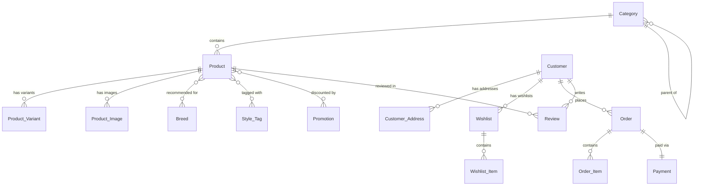

# Schema Overview

## Domain Model

## Five Business Domains

### 1. Products

The core domain. Products have categories (self-referencing hierarchy), variants (size/color/SKU), images, breed recommendations, and style tags.

| Table | Rows | Key Feature |
|---|---|---|
| Category | 5 | Self-referencing `parent_category_id` |
| Product | 15 | Base product info + pricing |
| Product_Variant | 45 | Size, color, SKU, stock per variant |
| Product_Image | 20 | Multiple images per product/variant |
| Breed | 8 | Dog breeds with size categories |
| Style_Tag | 6 | Fashion tags (Casual, Formal, etc.) |
| Product_Breed_Rec | 25 | M:N — which products fit which breeds |
| Product_Style_Tag | 30 | M:N — product style categorization |

### 2. Customers

Customer profiles with multiple addresses and wishlists.

| Table | Rows | Key Feature |
|---|---|---|
| Customer | 10 | Email, phone, registration date |
| Customer_Address | 15 | Multiple addresses per customer |
| Wishlist | 5 | Named wishlists |
| Wishlist_Item | 12 | Products on wishlists |

### 3. Orders

Full order lifecycle: placed → items → payment.

| Table | Rows | Key Feature |
|---|---|---|
| Order | 20 | Status workflow, shipping address FK |
| Order_Item | 50 | Variant-level line items with quantity |
| Payment | 20 | Payment method, status, amounts |

### 4. Reviews

Customer feedback on products.

| Table | Rows | Key Feature |
|---|---|---|
| Review | 15 | Rating (1-5), text, customer + product FKs |

### 5. Promotions

Time-limited discounts linked to products.

| Table | Rows | Key Feature |
|---|---|---|
| Promotion | 4 | Discount percentage, date range |
| Promotion_Product | 10 | M:N — which products are on promotion |

## Design Decisions

!!! info "Sparse Associative Tables"
    Product_Breed_Rec (25 rows) and Product_Style_Tag (30 rows) are deliberately sparse — not every product is recommended for every breed or tagged with every style. This reflects realistic data.

!!! info "Self-Referencing Category"
    The `Category` table has a `parent_category_id` FK pointing to itself, enabling subcategories (e.g., "Accessories" → "Collars", "Leashes").

!!! info "MySQL Syntax"
    All DDL uses MySQL syntax (`AUTO_INCREMENT`, `TIMESTAMP DEFAULT CURRENT_TIMESTAMP`). For Oracle, adjustments are needed (sequences, `SYSDATE`).
