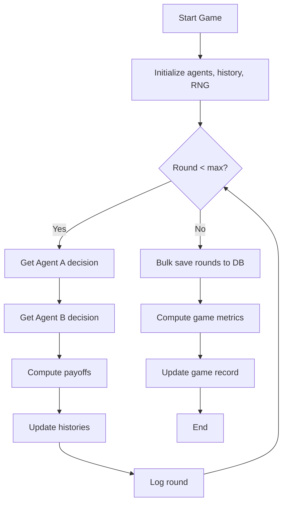
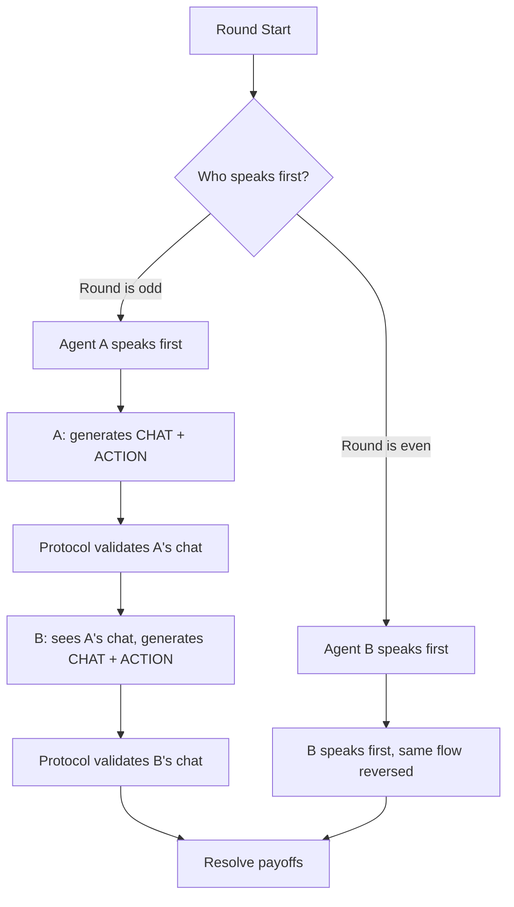

# Game Engine

The game engine (`games/engine.py`) runs the Iterated Prisoner's Dilemma loop for each game.

## Game Loop



## Horizon Types

### Fixed Horizon
The game runs for exactly N rounds (default: 100). Both agents know the total.

### Geometric Horizon
Each round, the game has probability `stop_prob` (default: 0.02) of ending. Pre-computed at game start using a seeded RNG. Agents don't know when the game will end — this changes optimal strategy significantly (no "end-game defection").

## Payoff Matrix

Standard Prisoner's Dilemma payoffs:

|  | Opponent: C | Opponent: D |
|---|:---:|:---:|
| **You: C** | 3, 3 | 0, 5 |
| **You: D** | 5, 0 | 1, 1 |

- **Temptation (T)** = 5: Reward for defecting when opponent cooperates
- **Reward (R)** = 3: Mutual cooperation payoff
- **Punishment (P)** = 1: Mutual defection payoff
- **Sucker (S)** = 0: Penalty for cooperating when opponent defects

The PD constraint: T > R > P > S and 2R > T + S

## Agent Resolution

Each condition specifies two agents, which can be:

- **LLM Agent** → Creates a `MockPDAgent` (or real CrewAI agent when wired)
- **Policy Agent** → Uses `PolicyEngine` for deterministic decisions

```python
def resolve_agent_for_condition(condition, side):
    if side == "a":
        llm_agent = condition.agent_a_llm
        policy_agent = condition.agent_a_policy
    ...
```

## History Format

Each agent maintains its own perspective of the history:

```python
history_a.append({
    "round": 1,
    "my_action": "C",      # What I did
    "opp_action": "D",     # What opponent did
    "my_payoff": 0,        # What I got
    "opp_payoff": 5,       # What opponent got
})
```

The last 10 entries are formatted into the prompt using `format_history_line()`.

## Response Parsing

LLM responses are parsed by `parse_action()`:

1. Check if first character is C or D → use it
2. If not, search first line for standalone C or D (word boundary)
3. If still no match, default to C and log a parse error

Retry logic (up to 2 retries) with framing-specific corrective prompts. Parse errors are flagged on `GameRound.agent_a_parse_error` / `agent_b_parse_error`.

## Chat Phase

When `chat_enabled=True`, the game loop changes:



Chat and action are collected in a single LLM call using `CHAT:` and `ACTION:` markers.

## Running an Experiment

```python
from games.engine import run_experiment

# experiment_obj has conditions, each with agent assignments
run_experiment(experiment_obj)
# Creates Game objects, runs all rounds, computes metrics
```

The engine:

1. Sets experiment status to "running"
2. Iterates through conditions × replicates
3. Creates a `Game` for each replicate with a random seed
4. Runs all rounds via `run_game()`
5. Bulk-creates `GameRound` records
6. Computes and stores metrics
7. Sets experiment status to "completed" (or "failed")
