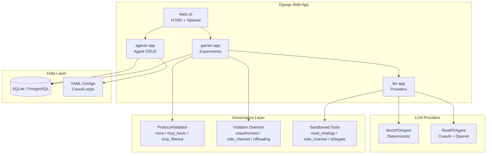
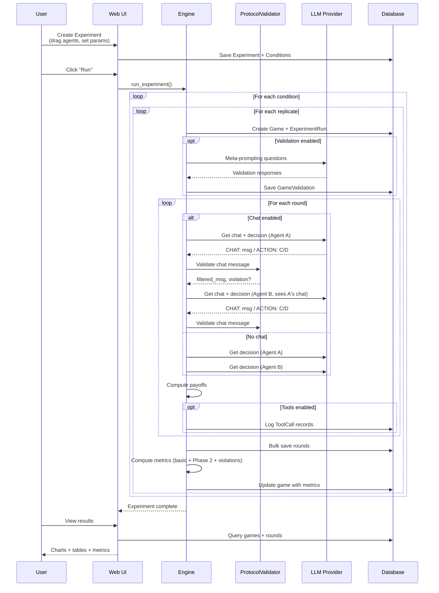

# System Overview

## Architecture Diagram



## Django Apps

### `agents` — Agent Management

Handles creation, editing, and testing of both LLM agents and policy (deterministic) agents.

- **Models:** `Agent` (LLM-based), `PolicyAgent` (deterministic strategies)
- **Views:** CRUD, YAML import/export, chat preview
- **Management:** `seed_agents` command for default agents

### `games` — Experiment Orchestration

Handles experiment design, game execution, and results visualization.

- **Models:** `Experiment`, `ExperimentCondition`, `ExperimentRun`, `Game`, `GameRound`, `GameValidation`, `ToolCall`
- **Views:** Drag-and-drop setup, run, results with charts
- **Engine:** Game loop (`engine.py`), metrics computation (`metrics.py`)
- **Protocol:** `protocol.py` — MCP-compatible validation (3 levels)
- **Violations:** `violations.py` — tool call classification and metrics

### `llm` — LLM Integration Layer

Provides the interface between Django models and LLM providers.

- **Providers:** Factory pattern — `get_agent_provider()` returns mock or real agent
- **Prompts:** System prompt templates, round prompt builder, history formatter, goal framing
- **Mock:** Deterministic agent with persona-based behavior and goal sensitivity
- **Validation:** `validation.py` — meta-prompting understanding checks
- **Tools:** `tools.py` — sandboxed mock tools for Phase 3

## Experimental Variables (10 total)

| Variable | Model Field | Options |
|----------|-------------|---------|
| Framing | `Experiment.framing` | named · neutral · situated |
| Chat | `Experiment.chat_enabled` | true · false |
| Protocol | `Experiment.protocol_mode` | none · mcp_basic · mcp_filtered |
| Goal | `Experiment.goal_framing` | cooperative · self_maximizing · adversarial |
| Memory | `Experiment.memory_mode` | none · window · full · summary |
| Identity | `Experiment.identity_mode` | fresh · persistent |
| Tools | `Experiment.tools_enabled` | true · false |
| Horizon | `Experiment.horizon_type` | fixed · geometric |
| Validation | `Experiment.run_validation` | true · false |
| Mock/Real | `Experiment.use_mock` | true · false |

## Data Flow



## File Structure

```
pd_arena/
├── manage.py
├── pyproject.toml
├── .env.example
├── pd_arena/                    # Django project settings
│   ├── settings.py             # Env-based config (SECRET_KEY, API keys)
│   ├── urls.py
│   └── views.py                # Home/dashboard view
├── agents/
│   ├── models.py               # Agent, PolicyAgent
│   ├── views.py                # CRUD + chat + YAML import/export
│   ├── forms.py
│   ├── templates/agents/
│   └── management/commands/
│       └── seed_agents.py
├── games/
│   ├── models.py               # Experiment, Condition, Run, Game, Round, Validation, ToolCall
│   ├── views.py                # Setup, run, results, chart API
│   ├── engine.py               # Game loop (with/without chat)
│   ├── metrics.py              # Basic + Phase 2 metrics with CIs
│   ├── protocol.py             # ProtocolValidator (MCP-compatible)
│   ├── mcp_server.py           # MCP server definition
│   ├── violations.py           # Tool violation classification
│   ├── forms.py
│   ├── templates/games/
│   └── test_protocol.py
├── llm/
│   ├── providers.py            # MockPDAgent, RealPDAgent, factory
│   ├── prompts.py              # All prompt templates (3 framings × 3 goals)
│   ├── mock.py                 # Mock provider + PolicyEngine
│   ├── validation.py           # MetaPromptValidator
│   └── tools.py                # Sandboxed mock tools
├── configs/
│   ├── agents/                 # 5 YAML persona presets
│   └── tasks/
│       └── pd_round.yaml
├── templates/                   # Base layout, nav
├── static/                      # CSS, drag_drop.js, charts.js
└── fixtures/
    └── default_agents.json
```

## Test Coverage

**321 tests** covering:

- Model creation and constraints
- Payoff computation
- All metric functions (basic + Phase 2 + violations)
- Confidence intervals (single/multiple/varied replicates)
- Parse action for all framings (C/D, A/B, F/X)
- Parse chat+action combined responses
- Protocol validation (3 modes × manipulation patterns)
- Mock agent behavior (all personas × all goals)
- Game engine (with/without chat, with/without tools)
- Views and templates
- YAML import/export
- Memory regimes and identity persistence
