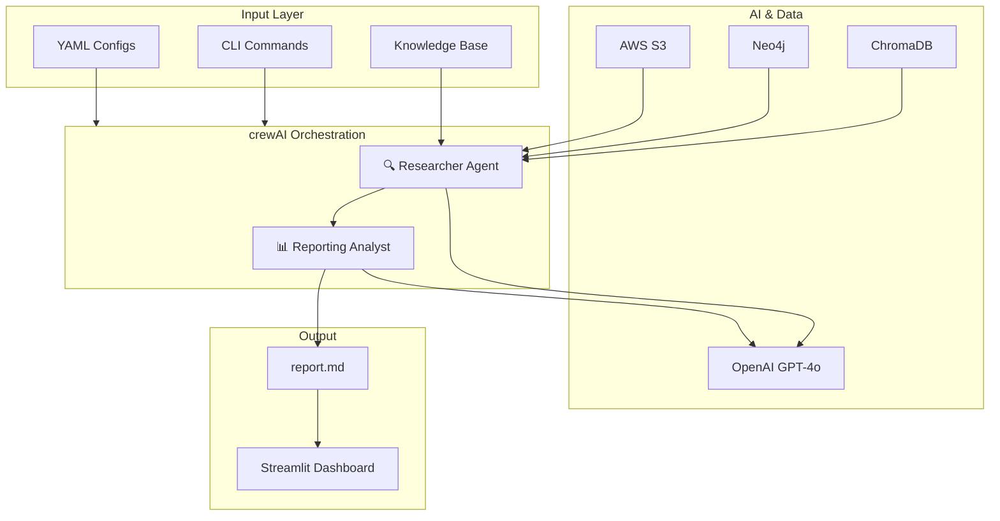

# System Overview

## Architecture



## Data Flow

```
User Input (topic, year)
        │
        ▼
┌───────────────────┐
│  crewAI Crew      │
│  Orchestration    │
└───────────────────┘
        │
        ▼
┌───────────────────┐
│  Researcher Agent │──► Web Search & Information Gathering
└───────────────────┘
        │
        ▼ (10 bullet points)
┌───────────────────┐
│ Reporting Analyst │──► Format & Expand Content
└───────────────────┘
        │
        ▼
┌───────────────────┐
│  report.md        │──► Markdown Output File
└───────────────────┘
```

## Project Structure

```
3_Pineapple_Course_Assistant/
├── src/pineapple/
│   ├── main.py          # Entry point and CLI handlers
│   ├── crew.py          # Crew orchestration and agent definitions
│   ├── config/
│   │   ├── agents.yaml  # Agent configurations
│   │   └── tasks.yaml   # Task definitions
│   └── tools/
│       └── custom_tool.py  # Template for custom tools
├── knowledge/
│   └── user_preference.txt  # User profile and preferences
├── pyproject.toml
└── .env                 # API keys
```

## Execution Model

crewAI runs agents **sequentially** by default:

1. Researcher completes its task → produces 10 bullet points
2. Reporting Analyst receives the bullets → expands into full report
3. Output saved to `report.md`

The execution model can be configured to **hierarchical** mode where a manager agent delegates and coordinates.
