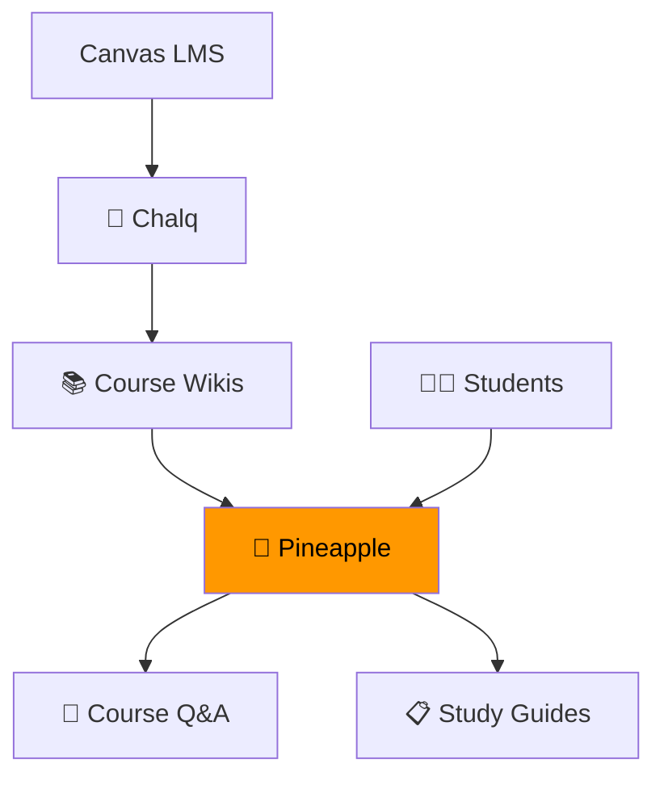

# 🍍 Pineapple

> **AI-powered course assistant — research, report, and answer questions about your courses.**

Pineapple is a multi-agent AI system powered by [crewAI](https://crewai.com) that automates course-related research and generates comprehensive reports. It uses specialized AI agents working in collaboration to gather, analyze, and present information.

## What It Does

Pineapple has two agents that work together:

1. **Researcher Agent** — Gathers information on specified topics using web search and knowledge bases
2. **Reporting Analyst** — Takes research findings and expands them into polished markdown reports


## Quick Start

```bash
cd 3_Pineapple_Course_Assistant
uv sync
uv run pineapple run
```

Output: `report.md` with comprehensive research findings.

## Future Vision

Pineapple is positioned to become the **AI layer on top of course wikis**:



- **Chalq** converts course materials into structured wikis
- **Pineapple** consumes those wikis and answers student questions
- Students get an AI tutor that knows their specific course content

## Tech Stack

| Component | Technology |
|---|---|
| Agent Framework | crewAI (≥0.118) |
| LLM | OpenAI GPT-4o |
| Vector DB | ChromaDB |
| Graph DB | Neo4j |
| Cloud | AWS (S3) |
| Web UI | Streamlit |
| Backend | Django |
| Package Manager | UV |

## Project Status

| Attribute | Value |
|---|---|
| Version | 0.1.0 |
| Status | Early development |
| Python | ≥3.10, <3.13 |
| Agents | 2 (Researcher + Reporting Analyst) |

---

*Jose Pineda — Assistant Professor, CSULB*
