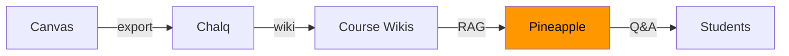

# Roadmap

## Current State: Early Prototype

Pineapple currently runs as a basic crewAI research-and-report pipeline. Two agents, two tasks, markdown output.

## Vision

Pineapple becomes the **AI layer on top of course wikis** — a course-specific AI tutor that knows the material, answers student questions, generates study guides, and assists during office hours.

## Milestones

### M1: Course-Aware RAG

- [ ] Ingest Chalq wiki output (markdown files)
- [ ] Embed pages in ChromaDB for semantic search
- [ ] Course Expert agent that answers questions using wiki content
- [ ] Streamlit chat interface for Q&A

### M2: Study Tools

- [ ] Quiz Generator agent (from wiki content)
- [ ] Study Guide Builder (condensed summaries)
- [ ] Practice problem generator (for database courses)

### M3: Office Hours Bot

- [ ] Real-time Q&A during designated hours
- [ ] Conversation memory within a session
- [ ] Escalation to professor for unanswerable questions
- [ ] Multi-course support

### M4: Integration

- [ ] Canvas LMS integration (announcements, grades context)
- [ ] Slack/Discord bot for student communities
- [ ] Analytics dashboard (common questions, knowledge gaps)

## Relationship to Other Projects

Pineapple depends on Chalq's output. Building Chalq first (structured wiki content) makes Pineapple's RAG much more effective than working directly from raw Canvas exports.
