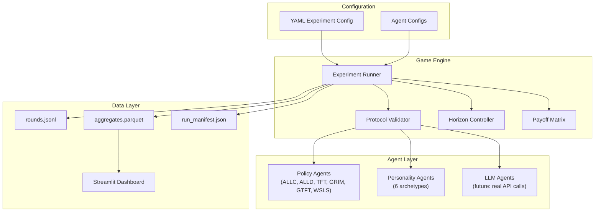

# System Overview

## Architecture Diagram



## Package Structure

```
src/pd_phase2/
├── agents/
│   ├── base.py          # Agent + CommunicatingAgent protocols
│   ├── policy.py         # 6 classic PD strategies
│   ├── personality.py    # 6 personality archetypes
│   └── __init__.py
├── core/
│   ├── types.py          # Pydantic models (Action, Observation, RoundRecord)
│   ├── payoff.py         # Payoff matrix computation
│   ├── horizon.py        # Fixed / geometric stopping rules
│   ├── transcript.py     # History window management
│   ├── metrics.py        # Standard + extended metrics
│   ├── protocol.py       # Unstructured / Structured channel validators
│   ├── rng.py            # Seeded random number generator
│   ├── logging.py        # JSONL + manifest writers
│   └── __init__.py
├── runners/
│   ├── registry.py       # Config → agent factory
│   ├── run_experiment.py # Main game loop with optional chat phase
│   └── __init__.py
├── storage/
│   ├── aggregate.py      # Parquet aggregation
│   └── __init__.py
├── ui/
│   ├── streamlit_app.py  # Interactive dashboard
│   └── __init__.py
└── cli.py                # Typer CLI (pd2 command)
```

## Game Loop

```python
# Simplified game loop (from run_experiment.py)
for round_num in range(max_rounds):
    # Optional chat phase
    if chat_enabled:
        msg_a = agent_a.chat(obs_a, last_msg_b)
        msg_b = agent_b.chat(obs_b, last_msg_a)
        msg_a = protocol.validate_chat(msg_a)  # Filter if structured
        msg_b = protocol.validate_chat(msg_b)

    # Action phase
    action_a = agent_a.act(obs_a)
    action_b = agent_b.act(obs_b)
    action_a = protocol.validate_action(action_a)  # Validate if structured
    action_b = protocol.validate_action(action_b)

    # Payoff
    pay_a, pay_b = payoff_matrix.get(action_a, action_b)
    
    # Log and update observations
    log_round(round_num, action_a, action_b, pay_a, pay_b, msg_a, msg_b)
    obs_a = update_observation(obs_a, action_a, action_b, pay_a)
    obs_b = update_observation(obs_b, action_b, action_a, pay_b)

    # Check horizon
    if horizon.should_stop(round_num):
        break
```

## Design Principles

1. **Zero API cost for development** — Personality agents simulate LLM-like behavior without API calls
2. **Reproducible** — Seeded RNG, deterministic agents, structured logs
3. **Modular** — Agents, protocols, and metrics are independent and composable
4. **Backward compatible** — Phase 2 agents work alongside Phase 1 policy agents
5. **Progressive complexity** — Start simple (policy agents), add layers (personality, chat, protocol, tools)
