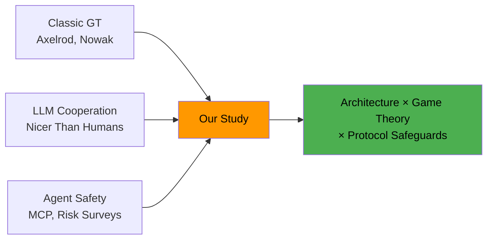

# Literature Review

## Key Papers

The project draws on three research threads: classic game theory, LLM cooperation studies, and agent safety.

### Classic Game Theory

#### Axelrod's Tournaments (1984)
Robert Axelrod's computer tournaments established that **Tit-for-Tat (TFT)** — cooperate first, then mirror the opponent — wins iterated PD against diverse strategies. Key findings:

- Nice strategies (never defect first) outperform aggressive ones
- Forgiving strategies recover from mutual defection faster
- Reciprocity is essential for sustaining cooperation

!!! note "Our Extension"
    We implement TFT and five other classic strategies as baseline agents. Personality agents extend these with LLM-like behavioral patterns.

#### Nowak's Five Mechanisms (2006)
Martin Nowak identified five mechanisms enabling cooperation to evolve:

1. **Kin selection** — cooperate with relatives
2. **Direct reciprocity** — repeated interactions (our IPD setting)
3. **Indirect reciprocity** — reputation effects
4. **Network reciprocity** — spatial structure
5. **Group selection** — between-group competition

Our study focuses on **direct reciprocity** with extensions toward reputation (via chat) and protocol structure.

### LLM Cooperation Studies

#### "LLMs Are Nicer Than Humans" (2024)
Tested GPT-4, Claude, and others in one-shot and iterated PD:

- LLMs cooperate at higher rates than human subjects
- Cooperation rates vary significantly by model
- Framing effects (competitive vs. cooperative language) strongly influence outcomes

!!! abstract "Gap We Address"
    This study used vanilla prompts with no agent architecture. We test how memory, identity, tools, and protocols change these dynamics.

#### "Negotiation and Deception in LLMs" (2024)
Studied LLM behavior in negotiation games:

- LLMs can be prompted to deceive effectively
- Deceptive agents gain short-term advantage but face retaliation
- Chain-of-thought prompting affects strategic behavior

#### "Emergent Social Learning in Multi-Agent Systems" (2024)
Found that multi-agent systems can develop cooperation through:

- Shared memory and observation
- Reputation systems
- Protocol-enforced norms

### Agent Safety & Protocols

#### Model Context Protocol (MCP)
Anthropic's protocol for structured agent-tool interaction:

- Defines schemas for tool calls and responses
- Enables server-side validation of agent actions
- Designed for human-agent interaction but applicable to agent-agent

!!! abstract "Our Application"
    We adapt MCP concepts to agent-agent communication: structured channels with action validation, message filtering, and violation logging.

#### "Risks from AI Agents" (2024)
Surveys risks from autonomous AI agents:

- Tool misuse and unauthorized actions
- Data exfiltration through side channels
- Social engineering of other agents
- Cascading failures in multi-agent systems

Our Phase 3 (Tools + Ill Intent) directly tests several of these risk categories.

## Literature Gap Summary

**Nobody has combined all three:** agent architecture features as experimental variables in a game-theoretic setting with protocol safeguards. That's our contribution.

## Papers Library

11 PDFs are collected in `prisoners-dilemma/papers/` within the Chalq repository for reference during paper writing.
