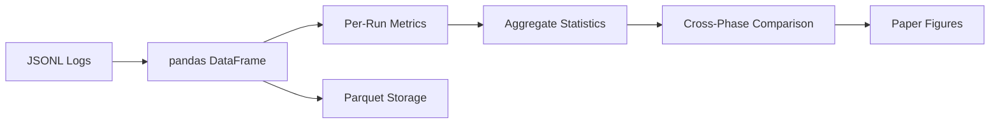

# Metrics & Analysis

## Standard PD Metrics

| Metric | Description | Formula |
|---|---|---|
| **Cooperation Rate** | Fraction of rounds where agent cooperated | $\frac{\text{C rounds}}{\text{total rounds}}$ |
| **Mutual Cooperation Rate** | Fraction of rounds both cooperated | $\frac{\text{(C,C) rounds}}{\text{total rounds}}$ |
| **Average Payoff** | Mean payoff per round | $\frac{\sum \text{payoffs}}{n}$ |
| **Payoff Gap** | Asymmetry between agents | $\bar{p}_A - \bar{p}_B$ |

## Extended Metrics (Phase 2+)

### Deception Success Rate

When an agent sends a cooperative chat message but defects, what fraction of the time does the opponent cooperate?

$$\text{Deception Rate} = \frac{|\text{chat=C, act=D, opp\_act=C}|}{|\text{chat=C, act=D}|}$$

Higher values indicate successful manipulation via chat.

### Chat Consistency

Correlation between chat signals and actual actions:

$$\text{Consistency} = \text{corr}(\text{chat\_signal}, \text{actual\_action})$$

- 1.0 = always follows through on chat signals
- 0.0 = chat and action are uncorrelated
- Negative = systematically deceptive

### Protocol Violation Count

Messages rejected by the ProtocolValidator in structured mode:

- Malformed action messages
- Manipulation patterns in chat (configurable blocklist)
- Out-of-scope tool calls

### Exploitation Window

Maximum consecutive rounds where one agent exploited the other:

$$\text{Max}_{i} \; |\text{consecutive rounds where } (a_i = C, b_i = D)|$$

Longer windows indicate failure to detect/retaliate.

### Trust Recovery Time

After an exploitation event (one agent defects while the other cooperates), how many rounds until mutual cooperation resumes?

$$\text{Recovery} = \text{min}(t - t_{\text{exploit}}) \text{ where } a_t = C \text{ and } b_t = C$$

## Analysis Pipeline

### Output Formats

| File | Format | Content |
|---|---|---|
| `rounds.jsonl` | JSON Lines | Per-round actions, chat, payoffs |
| `aggregates.parquet` | Parquet | Per-run aggregate metrics |
| `run_manifest.json` | JSON | Run metadata (config, seed, timestamps) |

### Visualization

Streamlit dashboard (`pd_phase2.ui.streamlit_app`) provides:

- Cooperation rate heatmaps (strategy × strategy)
- Payoff distribution violin plots
- Exploitation timeline charts
- Phase-over-phase comparison tables
