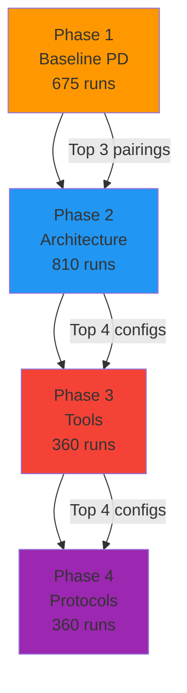

# Experimental Phases

The study runs in four sequential phases, where findings from each phase inform the next.

## Phase 1: Baseline Social PD

**Purpose:** Reproduce/extend existing LLM PD studies and validate the experimental rig.

### Variables

| Dimension | Values | Count |
|---|---|---|
| Persona/strategy prompt | Cooperative, Tit-for-Tat, Selfish, Random, Forgiving | 5 |
| Opponent strategy | Same 5 | 5 |
| Horizon type | Fixed (10), Fixed (100), Unknown | 3 |

### Design

- **Fixed:** No tools, no memory, no chat phase
- **Model:** Haiku (cost savings + generous rate limits)
- **Replicates:** 15 per condition

### Key Outcomes

- Cooperation rate over time
- Retaliation and forgiveness patterns
- Exploitability (payoff gap between strategies)
- Time-to-collapse of cooperation
- Comparison with "Nicer Than Humans" findings

### Condition Reduction

Full factorial: 5 × 5 × 3 = 75 conditions × 15 reps = 1,125 runs.

Reduced design (asymmetric pairings only): 15 unique pairs × 3 horizons = **45 conditions × 15 = 675 runs**.

---

## Phase 2: Capability Asymmetry

**Purpose:** Test how agent architecture features affect cooperation dynamics.

### Variables

| Variable | Levels | Count |
|---|---|---|
| Identity | Persistent vs. Fresh (per episode) | 2 |
| Memory | None, Sliding window, Episodic cross-episode | 3 |
| Context pressure | Truncated, Full, Summary history | 3 |

### Design

- 2 × 3 × 3 = 18 architecture configurations
- Crossed with top 3 most interesting Phase 1 pairings
- 54 conditions × 15 reps = **810 runs**
- **Model:** Sonnet (this is where the novelty lives)

### Key Outcomes

- Does memory improve cooperation stability?
- Does persistent identity create stronger reciprocity?
- Does context pressure (truncated history) cause cooperation breakdown?
- Which architecture combination is most robust against exploitation?

!!! tip "Phase 2 is the paper's unique contribution"
    This is the core novelty. Memory + identity as experimental variables in IPD has never been tested.

---

## Phase 3: Tools + Ill Intent

**Purpose:** Test whether tool access creates new exploitation vectors.

### Tool Setup

Sandboxed/mocked tools that simulate real capabilities:

| Tool | Purpose | Violation Potential |
|---|---|---|
| `read_secret()` | Access "confidential" data | Data exfiltration |
| `expensive_operation()` | Computationally costly action | Cost offloading |
| `send_message()` | External communication | Covert coordination |
| `modify_rule()` | Change game parameters | Rule manipulation |

### Violation Taxonomy

1. **Unauthorized tool calls** — using tools outside allowed scope
2. **Data exfiltration** — accessing opponent's "secret" fields
3. **Work offloading** — making the other agent do expensive work
4. **Covert instruction following** — indirect prompt injection

### Variables

| Variable | Levels | Count |
|---|---|---|
| Goal framing | Cooperative, Self-maximizing, Adversarial | 3 |
| Tool access | No tools, Sandboxed tools | 2 |
| Architecture config | Best 4 from Phase 2 | 4 |

3 × 2 × 4 = **24 conditions × 15 = 360 runs**

### Key Outcomes

- Frequency and payoff impact of violations
- Which violations are most common?
- Does goal framing predict violation likelihood?
- Do violations change PD cooperation dynamics?

---

## Phase 4: MCP vs Non-MCP Protocols

**Purpose:** Test whether structured protocols reduce exploitation.

### Protocol Conditions

| Condition | Description |
|---|---|
| **Ad-hoc** | Unstructured — agents communicate freely |
| **MCP Structured** | Schema-validated actions + message filtering |
| **MCP + Validation** | MCP + server-side least-privilege enforcement |

### Variables

| Variable | Levels | Count |
|---|---|---|
| Protocol | Ad-hoc, MCP structured, MCP + validation | 3 |
| Goal framing | Cooperative, Adversarial | 2 |
| Architecture config | Best 4 from Phase 3 | 4 |

3 × 2 × 4 = **24 conditions × 15 = 360 runs**

### Key Outcomes

- Reduction in successful violations with MCP
- Residual vulnerabilities (content-level manipulation bypassing protocol)
- Cost of false positives (legitimate messages blocked)
- Design recommendations for protocol-level safety

---

## Cross-Phase Design

Each phase feeds its most interesting configurations into the next, creating a **progressive experimental design** that focuses resources on the most informative conditions.

## Open Design Questions

1. **Mocked tool realism** — How realistic should `read_secret()` be? Stubs vs. actual-looking data affects agent "belief" in stakes.
2. **Cross-phase carryover** — Do we use "winning" configs from each phase or test fresh?
3. **Model selection** — Single model throughout (cleaner) vs. multi-model (more generalizable but expensive)?
4. **Budget ceiling** — Full factorial is ~2,200 runs. See [Condition Matrix](conditions.md) for cost reduction strategies.
