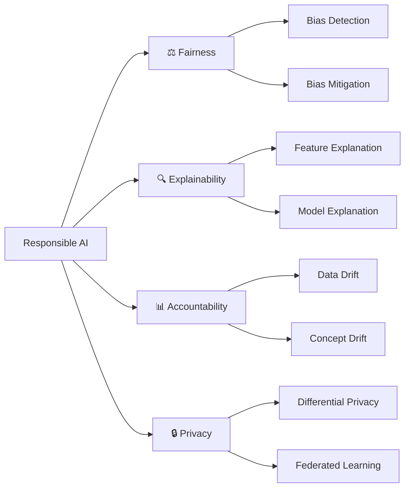

# IS671 — Responsible AI

> Building fair, explainable, accountable, and privacy-preserving AI systems.

This wiki covers the core concepts, techniques, and Python implementations from *Responsible AI: Implementing Ethical and Unbiased Algorithms* by Sray Agarwal & Shashin Mishra (Springer, 2021) — as taught at California State University, Long Beach.

## The Four Pillars of Responsible AI



## Course Chapters

| Ch | Topic | Focus |
|----|-------|-------|
| 1 | [Introduction](modules/ch1-introduction/index.md) | What is RAI and why it matters |
| 2 | [Fairness & Proxy Features](modules/ch2-fairness/index.md) | Confusion matrices, fairness metrics, proxy detection |
| 3 | [Bias in Data](modules/ch3-bias/index.md) | Statistical parity, disparate impact, visualization |
| 4 | [Explainability](modules/ch4-explainability/index.md) | Feature, model & output explanation techniques |
| 5 | [Remove Bias from ML Model](modules/ch5-remove-bias-model/index.md) | Reweighting, counterfactual fairness |
| 6 | [Remove Bias from Output](modules/ch6-remove-bias-output/index.md) | Reject Option Classifier |
| 7 | [Accountability](modules/ch7-accountability/index.md) | Data drift, concept drift, monitoring |
| 8 | [Data & Model Privacy](modules/ch8-privacy/index.md) | Differential privacy, federated learning, attacks |
| 9 | [Conclusion](modules/ch9-conclusion/index.md) | RAI lifecycle, canvas, and checklist |

## How to Navigate

Each chapter builds on the previous:

1. **Understand fairness** — what it means, how to measure it (Ch 1–2)
2. **Detect bias** in your data before training (Ch 3)
3. **Explain** why your model makes decisions (Ch 4)
4. **Fix bias** at the model level and output level (Ch 5–6)
5. **Monitor** for drift and degradation in production (Ch 7)
6. **Protect** data and model privacy (Ch 8)

!!! tip "Running the Code"
    All Python examples use standard data science libraries: `scikit-learn`, `pandas`, `numpy`, `matplotlib`, and `seaborn`. Install them with:
    ```bash
    pip install scikit-learn pandas numpy matplotlib seaborn
    ```

---

*Course: IS671 — Responsible AI | CSULB | Prof. Jose Pineda*
*Textbook: Agarwal & Mishra, Responsible AI (Springer, 2021)*
