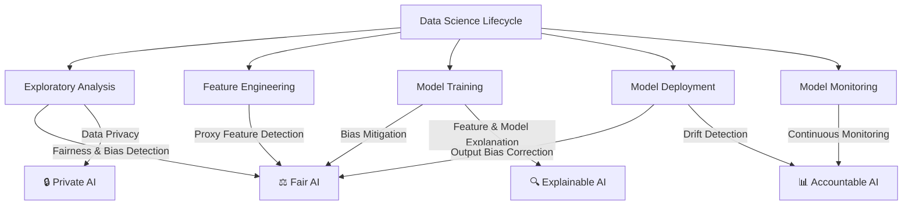

# Ch 1: Introduction to Responsible AI

## Why Responsible AI?

Machine learning algorithms now impact our lives in innumerable ways — from credit decisions and medical diagnoses to hiring and university admissions. With this impact comes responsibility: AI systems must be **fair**, **explainable**, **accountable**, and **privacy-preserving**.

!!! example "The A-Level Grading Fiasco (2020)"
    During the COVID-19 pandemic, the UK used an algorithm to predict A-level grades after exams were cancelled. The algorithm **increased grades for students at small private schools** (mostly affluent neighbourhoods) and **lowered grades for large public schools** (where many students belong to ethnic minorities or low-income families). The algorithm was decommissioned, but for many students the damage was already done.

!!! example "Princeton Review Pricing"
    The Princeton Review's online SAT tutoring packages ranged from $6,600 to $8,400 based on zip code. Zip codes with higher prices were disproportionately those with Asian-majority populations — including lower-income neighbourhoods.

## What Is Responsible AI?

Responsible AI aims to:

- **Reward users based on merit** (approve credit for someone with good income/history)
- **Not discriminate** based on attributes outside user control (reject credit because someone lives in a poorer neighbourhood)
- **Allow positive discrimination** to correct historical wrongs
- **Explain its decisions** transparently
- **Remain accountable** over time as data shifts

!!! note "Transparency vs Explainability"
    A 3-digit credit score is *transparent* — you can see it. But it's not *explainable* unless it also tells you **why** you have that score and **what actions** would improve it. Transparency alone hides more than it reveals.

## The Four Facets of RAI

### ⚖️ Fair AI (Chapters 2–3, 5–6)

Bias in decision-making is ancient, but ML models can **learn and amplify** human biases. Key challenges:

- Historical bias in training data
- Proxy features that smuggle protected information back in
- Engineered features that mask discrimination

!!! warning "Real-World Bias Examples"
    - **Amazon** scrapped an ML recruiting tool that showed bias against women
    - **Bank of America** paid $335M to settle discrimination charges against African American and Hispanic borrowers
    - **Apple Card** gave lower credit limits to women vs men
    - **Google Photos** misidentified people of colour as primates

### 🔍 Explainable AI (Chapter 4)

Three dimensions of XAI:

1. **Feature explanation** — Which features drive the prediction?
2. **Model explanation** — How does the model work internally?
3. **Output explanation** — Why was *this specific* decision made?

### 📊 Accountable AI (Chapter 7)

Models degrade over time as data distributions shift:

- **Data drift** — features or predictions shift
- **Concept drift** — the relationship between features and target changes
- **Production skew** — differences between training and production environments

### 🔒 Data & Model Privacy (Chapter 8)

| Risk | Example |
|------|---------|
| **Linkage attacks** | Combining anonymized data with public records to re-identify individuals |
| **Model inversion** | Reverse-engineering training data from model parameters |
| **Data poisoning** | Injecting malicious data to skew model behavior |

## Stakeholder Responsibilities

RAI is **not just a data science concern**. Every role in a product team contributes:

| Role | RAI Responsibility |
|------|-------------------|
| **Product Owner** | Define acceptable fairness thresholds |
| **Business Analyst** | Identify protected features and proxy candidates |
| **Data Scientist** | Implement bias detection and mitigation |
| **ML Engineer** | Build monitoring and drift detection pipelines |
| **Ethics Committee** | Review and audit model decisions |

---

*Next: [Chapter 2 — Fairness & Proxy Features →](../ch2-fairness/index.md)*
