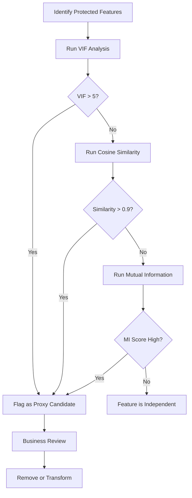

# Proxy Features

## What Are Proxy Features?

Removing protected features from your dataset does **not** guarantee your model is bias-free. Independent features can serve as **proxies** for protected features through correlation.

!!! warning "Common Misconception"
    "If I'm not using any protected features, I can't have bias." **Wrong.** Proxy features smuggle protected information back into the model.

### Common Proxy Relationships

| Proxy Feature | What It Reveals |
|---------------|-----------------|
| Tax paid | Income level |
| Zip code | Race / ethnicity |
| Shopping patterns | Gender / marital status |
| Disposable income | Gender / marital status |
| Salary + age combined | Gender / promotions |
| Car engine size | Buyer's gender |

!!! example "American Express (2019)"
    AmEx decreased credit limits for customers because *"other customers who used their card at establishments where you recently shopped have a poor repayment history."* Shopping location was a proxy for socio-economic status.

## Methods to Detect Proxy Features

### 1. Linear Regression

The simplest approach: regress one feature against another and check $R^2$.

$$X_1 = \lambda + a \times X_2$$

Standard error:

$$SE = \sqrt{1 - R^2_{adj}} \times \sigma_y$$

If $R^2 \approx 1$ (perfect fit), the features are collinear — one is a proxy for the other.

!!! tip
    Run regression with each protected feature as the dependent variable against all other features. High $R^2$ values indicate proxy candidates.

### 2. Variance Inflation Factor (VIF)

VIF measures multicollinearity by computing $R^2$ for each feature regressed against all others:

$$VIF = \frac{1}{1 - R^2}$$

| VIF Value | Interpretation |
|-----------|---------------|
| 1 | No collinearity |
| 1–5 | Moderate |
| > 5 | High collinearity — likely proxy |
| > 10 | Severe — strong proxy |

```python
import pandas as pd
import numpy as np
from statsmodels.stats.outliers_influence import variance_inflation_factor

def detect_proxies_vif(df, protected_col):
    """Detect proxy features using VIF."""
    # Include protected feature + all independent features
    features = df.select_dtypes(include=[np.number]).columns.tolist()
    
    vif_data = pd.DataFrame()
    vif_data["Feature"] = features
    vif_data["VIF"] = [
        variance_inflation_factor(df[features].values, i)
        for i in range(len(features))
    ]
    
    print(f"Proxy candidates for '{protected_col}':")
    print(vif_data.sort_values("VIF", ascending=False))
    return vif_data
```

!!! warning "VIF Limitation"
    VIF only detects **pairwise** collinearity. If a proxy is formed by a **combination** of features, pairwise VIF may miss it. Use mutual information for non-linear relationships.

### 3. Linear Association Using Variance

From the paper *"Hunting for Discriminatory Proxies in Linear Regression Models"*:

$$Assoc = \frac{cov(X_1, X_2)^2}{Var(X_1) \times Var(X_2)}$$

This is the square of the Pearson correlation coefficient — it highlights higher association values for stronger proxies.

### 4. Cosine Similarity

For **non-linear** relationships, use cosine similarity:

$$Similarity = \frac{A \cdot B}{\|A\| \times \|B\|} = \frac{\sum A_i B_i}{\sqrt{\sum A_i^2} \times \sqrt{\sum B_i^2}}$$

```python
from sklearn.metrics.pairwise import cosine_similarity
import pandas as pd
import numpy as np

def detect_proxies_cosine(df, protected_col):
    """Detect proxies using cosine similarity."""
    features = df.select_dtypes(include=[np.number]).columns
    protected_vec = df[protected_col].values.reshape(1, -1)
    
    results = {}
    for col in features:
        if col != protected_col:
            sim = cosine_similarity(
                protected_vec, 
                df[col].values.reshape(1, -1)
            )[0][0]
            results[col] = sim
    
    results_df = pd.DataFrame(
        results.items(), columns=['Feature', 'Cosine Similarity']
    ).sort_values('Cosine Similarity', ascending=False)
    
    print(f"Cosine similarity with '{protected_col}':")
    print(results_df)
    return results_df
```

!!! tip "When to Use Which Method"
    - **VIF / Linear Regression**: Good for linear relationships
    - **Cosine Similarity**: Works for non-linear and categorical proxies
    - **Mutual Information**: Best for capturing any type of dependency

### 5. Mutual Information

Mutual information measures how much information one variable reveals about another — it captures **any** relationship (linear or non-linear):

$$MI(X; Y) = \sum_{x}\sum_{y} p(x, y) \log\frac{p(x, y)}{p(x) \cdot p(y)}$$

```python
from sklearn.feature_selection import mutual_info_classif
import pandas as pd
import numpy as np

def detect_proxies_mi(df, protected_col):
    """Detect proxies using mutual information."""
    features = [c for c in df.select_dtypes(include=[np.number]).columns 
                if c != protected_col]
    
    mi_scores = mutual_info_classif(
        df[features], df[protected_col], random_state=42
    )
    
    results = pd.DataFrame({
        'Feature': features,
        'Mutual Information': mi_scores
    }).sort_values('Mutual Information', ascending=False)
    
    print(f"Mutual information with '{protected_col}':")
    print(results)
    return results
```

## Detection Strategy



!!! warning "Check After Feature Engineering Too"
    Proxy features can be **created** during feature engineering. For example, `disposable_income = total_income - expenses` can become a proxy for gender or marital status even if those features were already removed.

---

*Back to: [Chapter 2 Overview ←](index.md)*
