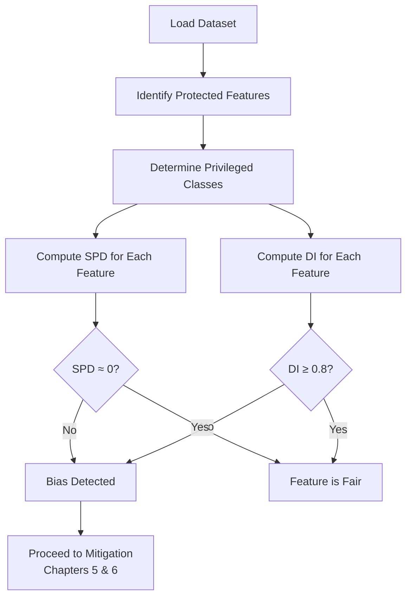

# Ch 3: Bias in Data

## Introduction

Unintended bias gets introduced through **historical data** — the actions, decisions, and patterns of humans encoded in training sets. A model trained on biased history will inherit and amplify those biases.

!!! example "Loan Default Dataset"
    A dataset with 61,321 records and 205 features. Among them, 15 are protected/sensitive features: gender, education, age group, home ownership, employment status, language, dependants, marital status, and work experience. The data shows 76% non-defaulters and 24% defaulters.

## Key Notation

| Symbol | Meaning |
|--------|---------|
| $D_{N \times M}$ | Dataset with N rows, M features |
| $X_j$ | Independent features (189 in example) |
| $S_j$ | Protected/sensitive features (15 in example) |
| $Y$ | Binary label (defaulter: 0/1) |
| $S_a$ | Advantaged group (higher P of favourable outcome) |
| $S_d$ | Disadvantaged group (lower P of favourable outcome) |

## Bias Metrics

### Statistical Parity Difference (SPD)

The difference in probability of favourable outcome between disadvantaged and advantaged groups:

$$SPD = P(Y = Y_{fav} \mid S = S_d) - P(Y = Y_{fav} \mid S = S_a)$$

!!! info "Interpretation"
    - **SPD = 0**: Perfect parity — both groups have equal probability of favourable outcome
    - **SPD < 0**: Disadvantaged group has lower probability (bias present)
    - **SPD > 0**: Disadvantaged group has higher probability

!!! example
    If 10% of male applicants get loans, statistical parity requires roughly 10% of female applicants to also get loans.

```python
import pandas as pd

def statistical_parity_difference(df, protected_col, privileged_val, target_col, fav_val):
    """Compute Statistical Parity Difference."""
    priv = df[df[protected_col] == privileged_val]
    unpriv = df[df[protected_col] != privileged_val]
    
    p_priv = (priv[target_col] == fav_val).mean()
    p_unpriv = (unpriv[target_col] == fav_val).mean()
    
    spd = p_unpriv - p_priv
    print(f"P(Y=fav | S=privileged): {p_priv:.4f}")
    print(f"P(Y=fav | S=unprivileged): {p_unpriv:.4f}")
    print(f"Statistical Parity Difference: {spd:.4f}")
    return spd
```

### Disparate Impact (DI)

The ratio of favourable outcome probabilities:

$$DI = \frac{P(Y = Y_{fav} \mid S = S_d)}{P(Y = Y_{fav} \mid S = S_a)}$$

!!! info "Interpretation"
    - **DI = 1.0**: Perfect parity
    - **DI < 0.8**: Legal threshold — evidence of disparate impact (the "80% rule")
    - **DI > 1.2**: Reverse disparity

```python
def disparate_impact(df, protected_col, privileged_val, target_col, fav_val):
    """Compute Disparate Impact ratio."""
    priv = df[df[protected_col] == privileged_val]
    unpriv = df[df[protected_col] != privileged_val]
    
    p_priv = (priv[target_col] == fav_val).mean()
    p_unpriv = (unpriv[target_col] == fav_val).mean()
    
    di = p_unpriv / p_priv if p_priv > 0 else float('inf')
    print(f"Disparate Impact: {di:.4f}")
    print(f"{'⚠️ Below 0.8 threshold!' if di < 0.8 else '✅ Above threshold'}")
    return di
```

## Visualizing Bias

### Heat Maps by Protected Feature

```python
import seaborn as sns
import matplotlib.pyplot as plt
import pandas as pd

def plot_bias_heatmap(df, protected_features, target_col):
    """Plot heatmaps showing outcome distribution by protected features."""
    for feature in protected_features:
        ct = pd.crosstab(
            df[feature], df[target_col], normalize='index'
        )
        plt.figure(figsize=(8, 4))
        sns.heatmap(ct, annot=True, fmt='.3f', cmap='RdYlGn')
        plt.title(f'Outcome Distribution by {feature}')
        plt.ylabel(feature)
        plt.xlabel('Outcome')
        plt.tight_layout()
        plt.show()
```

### SPD Across All Protected Features

```python
import matplotlib.pyplot as plt

def plot_spd_comparison(df, protected_features, privileged_vals, target_col, fav_val):
    """Bar chart of SPD across all protected features."""
    spds = []
    for feat, priv_val in zip(protected_features, privileged_vals):
        priv = df[df[feat] == priv_val]
        unpriv = df[df[feat] != priv_val]
        p_priv = (priv[target_col] == fav_val).mean()
        p_unpriv = (unpriv[target_col] == fav_val).mean()
        spds.append(p_unpriv - p_priv)
    
    colors = ['red' if s < -0.05 else 'green' if abs(s) < 0.05 else 'orange' 
              for s in spds]
    
    plt.figure(figsize=(10, 6))
    plt.barh(protected_features, spds, color=colors)
    plt.axvline(x=0, color='black', linestyle='--')
    plt.xlabel('Statistical Parity Difference')
    plt.title('Bias Assessment Across Protected Features')
    plt.tight_layout()
    plt.show()
```

## Bias Detection Workflow



!!! warning "Feature Engineering Can Introduce Bias"
    Biases not present in the original data can get introduced through engineered features. Check for bias **before and after** feature engineering.

---

*Next: [Chapter 4 — Explainability →](../ch4-explainability/index.md)*
