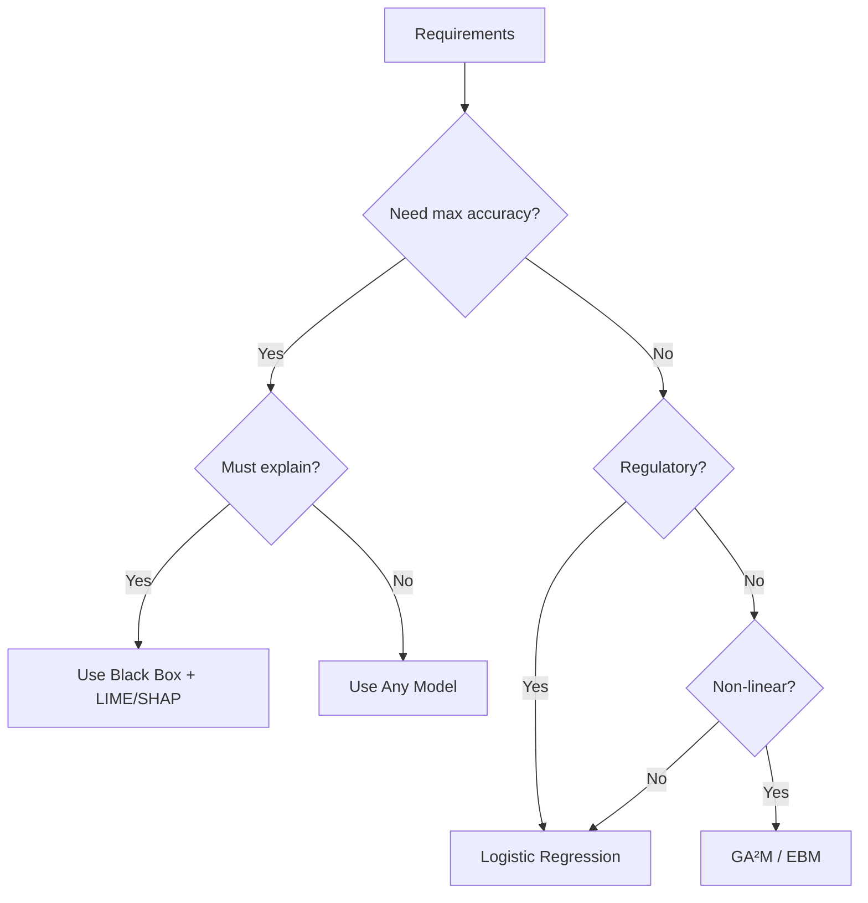

# Explainable (Glass Box) Models

Glass box models are **inherently interpretable** — they don't need post-hoc explanation techniques like LIME or SHAP because their decision-making process is transparent.

## Comparison

| Model | Interpretability | Performance | Best For |
|-------|-----------------|-------------|----------|
| Logistic Regression | ⭐⭐⭐⭐⭐ | ⭐⭐ | Linear problems, regulatory compliance |
| Decision Trees | ⭐⭐⭐⭐ | ⭐⭐⭐ | Rule-based decisions, small feature spaces |
| GA²M | ⭐⭐⭐⭐ | ⭐⭐⭐⭐ | Non-linear problems needing interpretability |

## Logistic Regression

The most interpretable classification model. Each coefficient directly tells you the **direction and magnitude** of a feature's influence.

$$P(Y=1|X) = \frac{1}{1 + e^{-(\beta_0 + \beta_1 x_1 + \beta_2 x_2 + \cdots)}}$$

```python
from sklearn.linear_model import LogisticRegression
import pandas as pd

model = LogisticRegression(max_iter=1000)
model.fit(X_train, y_train)

# Feature importance = coefficients
importance = pd.DataFrame({
    'Feature': X_train.columns,
    'Coefficient': model.coef_[0],
    'Odds Ratio': np.exp(model.coef_[0])
}).sort_values('Coefficient', key=abs, ascending=False)

print(importance.to_string(index=False))
```

!!! tip "Reading Coefficients"
    - **Positive coefficient**: Feature increases probability of favourable outcome
    - **Negative coefficient**: Feature decreases probability
    - **Odds ratio > 1**: Feature increases odds; < 1: decreases odds

## Decision Trees

Decision trees produce **human-readable rules** that can be directly audited for fairness.

```python
from sklearn.tree import DecisionTreeClassifier, export_text

model = DecisionTreeClassifier(max_depth=4, min_samples_leaf=50)
model.fit(X_train, y_train)

# Print rules
rules = export_text(model, feature_names=X_train.columns.tolist())
print(rules)
```

!!! warning "Depth Trade-off"
    Shallow trees are interpretable but may underfit. Deep trees perform better but become opaque. A depth of 3–5 is usually the sweet spot for interpretability.

## GA²M (Generalized Additive Models with Interactions)

GA²M models capture **non-linear relationships** while remaining interpretable — the best of both worlds.

$$g(E[y]) = \beta_0 + \sum f_i(x_i) + \sum f_{ij}(x_i, x_j)$$

Each $f_i$ is a learned shape function for one feature, and $f_{ij}$ captures pairwise interactions.

```python
from interpret.glassbox import ExplainableBoostingClassifier
from interpret import show

# Train
ebm = ExplainableBoostingClassifier(interactions=10)
ebm.fit(X_train, y_train)

# Global explanation
ebm_global = ebm.explain_global()
show(ebm_global)

# Local explanation (single prediction)
ebm_local = ebm.explain_local(X_test[:5], y_test[:5])
show(ebm_local)
```

!!! tip "InterpretML"
    Microsoft's `interpret` package provides `ExplainableBoostingClassifier` — a production-ready GA²M implementation. Install with: `pip install interpret`

## Choosing the Right Model



---

*Back to: [Chapter 4 Overview ←](index.md)*
