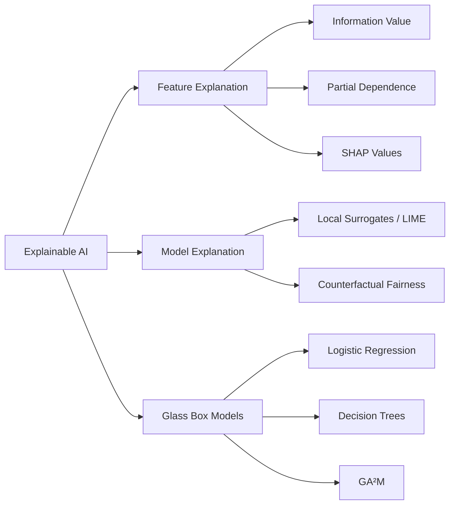
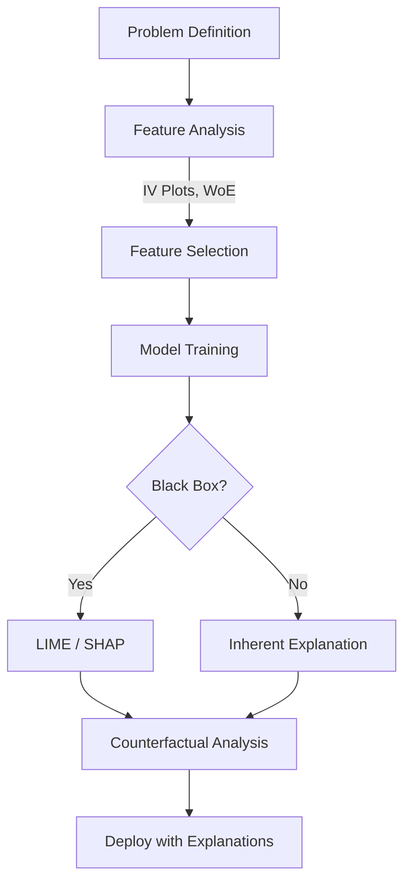

# Ch 4: Explainability

> When faced with a decision-making process that doesn't explain its decisions, it's natural to not trust it. This need is amplified when an algorithm is making decisions for us.

## Three Approaches to XAI

| Approach | When to Use | Key Techniques |
|----------|-------------|----------------|
| **[Feature Explanation](feature-explanation.md)** | Understand which features drive predictions | IV Plots, PDP, SHAP |
| **[Model Explanation](model-explanation.md)** | Explain black-box model decisions | LIME, Counterfactual Fairness |
| **[Explainable Models](explainable-models.md)** | Build inherently interpretable models | Logistic Regression, Decision Trees, GA²M |

## Why Explainability Matters

!!! warning "Beyond Transparency"
    Making a black box transparent by disclosing all nuts and bolts won't help RAI. You need to **explain the decisions**, not just show the mechanics.

Three dimensions of stakeholder needs:

| Stakeholder | What They Need |
|-------------|---------------|
| **Business** | Which features matter most? Is the model behaving as expected? |
| **End Users** | Why was *my* application rejected? What can I do differently? |
| **Regulators** | Can you prove the model isn't discriminating? |

## The XAI Lifecycle

!!! tip "Consider Explainability Early"
    Don't wait until after model training. The standard approach is: build model → explain. A better approach: **consider explanation before training** — use feature explanation during EDA to understand what drives outcomes.

---

*Next: [Feature Explanation →](feature-explanation.md)*
