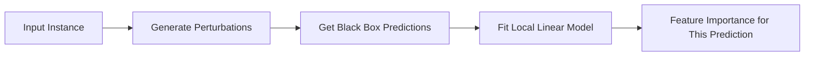

# Model Explanation

Model explanation techniques help explain **black-box** models by creating interpretable approximations or counterfactual analyses.

## LIME (Local Interpretable Model-agnostic Explanations)

LIME explains individual predictions by building a **local surrogate model** — a simple, interpretable model that approximates the black box in the neighbourhood of a specific prediction.



### How LIME Works

1. **Select** the instance to explain
2. **Perturb** the instance — create variations by modifying feature values
3. **Predict** each perturbation using the black-box model
4. **Weight** perturbations by proximity to the original instance
5. **Fit** a simple model (linear regression) on the weighted perturbations
6. **Extract** feature weights as the explanation

```python
import lime
import lime.lime_tabular

# Create explainer
explainer = lime.lime_tabular.LimeTabularExplainer(
    training_data=X_train.values,
    feature_names=X_train.columns.tolist(),
    class_names=['Non-Default', 'Default'],
    mode='classification'
)

# Explain a single prediction
exp = explainer.explain_instance(
    X_test.iloc[0].values,
    model.predict_proba,
    num_features=10
)

exp.show_in_notebook()
```

!!! warning "LIME Limitations"
    - Explanations are **local** — they may not generalize
    - Different perturbation strategies can give different explanations
    - Works best with tabular data; less reliable for images/text

## Counterfactual Fairness

Counterfactual fairness asks: **"What would the prediction be if this person belonged to a different protected group?"**

$$P(\hat{Y}_{S \leftarrow s'} = y \mid X = x, S = s) = P(\hat{Y}_{S \leftarrow s} = y \mid X = x, S = s)$$

A model is counterfactually fair if changing the protected attribute (and its causal descendants) does not change the prediction.

### Practical Application

```python
import pandas as pd
import numpy as np

def counterfactual_check(model, instance, protected_col, values_to_test):
    """Check how predictions change when protected attribute changes."""
    results = []
    original = instance.copy()
    
    for val in values_to_test:
        modified = original.copy()
        modified[protected_col] = val
        pred = model.predict_proba(modified.values.reshape(1, -1))[0]
        results.append({
            f'{protected_col}': val,
            'P(Favourable)': pred[1],
            'P(Unfavourable)': pred[0]
        })
    
    results_df = pd.DataFrame(results)
    print("Counterfactual Analysis:")
    print(results_df)
    
    max_diff = results_df['P(Favourable)'].max() - results_df['P(Favourable)'].min()
    print(f"\nMax prediction difference: {max_diff:.4f}")
    if max_diff > 0.05:
        print("⚠️ Model may not be counterfactually fair!")
    return results_df
```

### Counterfactual Explanations for Users

Counterfactuals also help **explain decisions to end users**: "Your loan was rejected. If your income were $5,000 higher, it would have been approved."

```python
def find_counterfactual(model, instance, target_class, feature_ranges, step_size=0.01):
    """Find the minimal change needed to flip a prediction."""
    current = instance.copy()
    original_pred = model.predict(current.values.reshape(1, -1))[0]
    
    for feature, (min_val, max_val) in feature_ranges.items():
        original_val = current[feature]
        
        # Try increasing
        for delta in np.arange(0, max_val - original_val, step_size):
            current[feature] = original_val + delta
            pred = model.predict(current.values.reshape(1, -1))[0]
            if pred == target_class:
                print(f"Change {feature}: {original_val:.2f} → {current[feature]:.2f}")
                return current
        
        current[feature] = original_val  # reset
    
    print("No counterfactual found within given ranges")
    return None
```

---

*Next: [Explainable Models →](explainable-models.md)*
