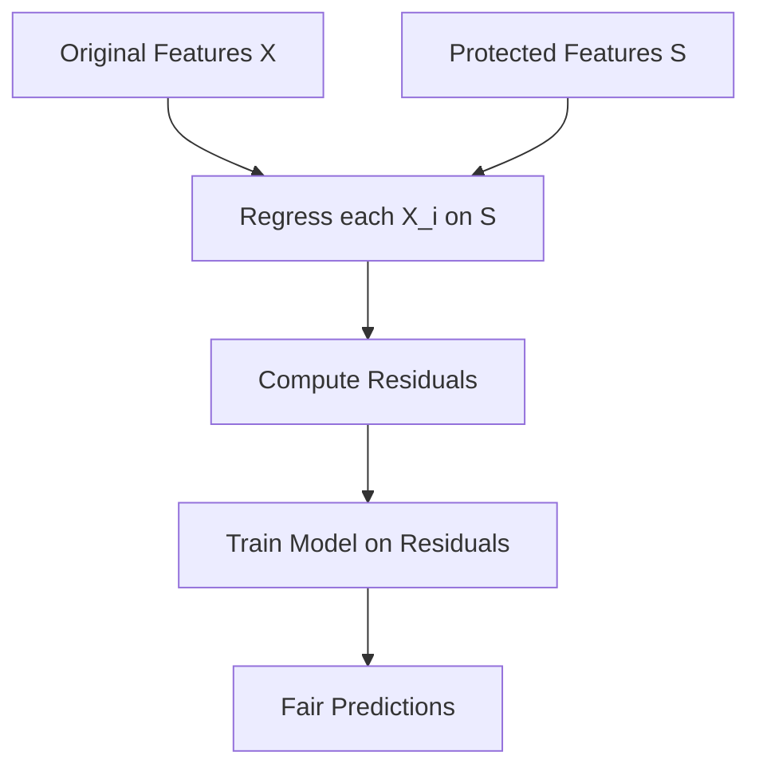
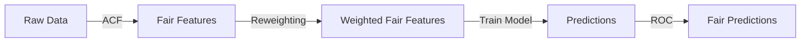

# Advanced Techniques: Additive Counterfactual Fairness

## Overview

Additive Counterfactual Fairness (ACF) is applied **during model training** and can handle **multiple protected features simultaneously** for both classification and regression.

### Key Differences from Reweighting

| Feature | Reweighting | ACF |
|---------|-------------|-----|
| When applied | Before training | During training |
| Protected features | One at a time (or composite) | Multiple simultaneously |
| Algorithm support | Classification only | Classification & regression |
| Data modification | None (weights only) | Uses residuals |
| Accuracy impact | Minimal | Moderate |

## How ACF Works

The core idea: remove the influence of protected features by working with **residuals** — the part of a feature that can't be predicted from the protected attributes.



### Step-by-Step

1. **For each independent feature** $X_i$, fit a regression model:

$$X_i = f(S_1, S_2, \ldots, S_k) + \epsilon_i$$

2. **Compute residuals** — the part of $X_i$ unexplained by protected features:

$$\tilde{X}_i = X_i - f(S_1, S_2, \ldots, S_k)$$

3. **Train your final model** on the residuals $\tilde{X}$ instead of the original features

### Python Implementation

```python
import numpy as np
import pandas as pd
from sklearn.linear_model import LinearRegression
from sklearn.ensemble import GradientBoostingClassifier

def additive_counterfactual_fairness(X, S, y):
    """Apply ACF: remove protected feature influence from independent features."""
    X_residuals = pd.DataFrame(index=X.index)
    residual_models = {}
    
    for col in X.columns:
        # Regress each feature on all protected features
        reg = LinearRegression()
        reg.fit(S, X[col])
        predicted = reg.predict(S)
        
        # Residual = original - predicted from protected features
        X_residuals[col] = X[col] - predicted
        residual_models[col] = reg
    
    return X_residuals, residual_models

# Usage
protected_features = ['gender', 'age_group', 'marital_status']
independent_features = [c for c in df.columns 
                       if c not in protected_features + ['default']]

S = df[protected_features]
X = df[independent_features]
y = df['default']

# Get fair features
X_fair, models = additive_counterfactual_fairness(X, S, y)

# Train on fair features
clf = GradientBoostingClassifier()
clf.fit(X_fair, y)
```

!!! tip "Verify Fairness"
    After ACF, check that fairness metrics improved:
    ```python
    y_pred = clf.predict(X_fair_test)
    # Compute fairness metrics as before
    ```

!!! warning "Trade-off"
    ACF removes **all** information correlated with protected features — including legitimate predictive signal. Monitor accuracy alongside fairness metrics.

## Combining Techniques

For maximum bias reduction, you can combine approaches:

1. **ACF** to remove protected feature influence from independent features
2. **Reweighting** on the residuals for additional fairness improvement
3. **ROC** (Chapter 6) on the output as a final safety net



---

*Back to: [Chapter 5 Overview ←](index.md)*
