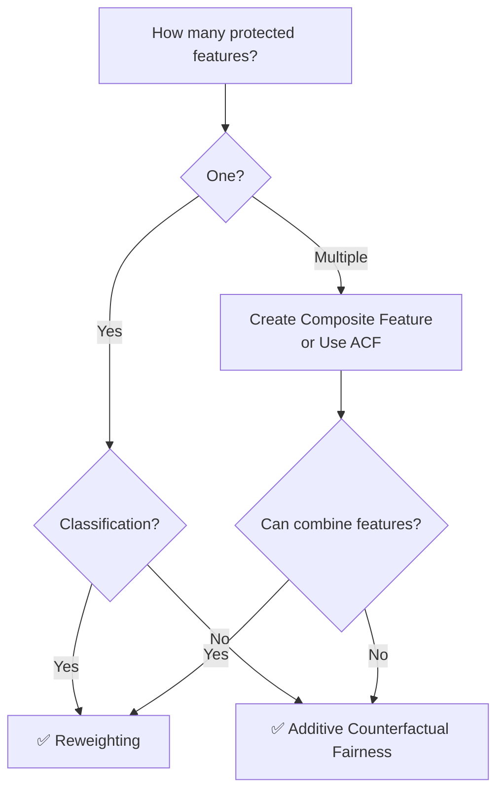

# Ch 5: Remove Bias from ML Model

## Introduction

This chapter covers **model-agnostic techniques** to overcome data bias during or before model training. These approaches work with most ML algorithms and help make the final model more explainable.

| Technique | When Applied | Handles | Algorithm Support |
|-----------|-------------|---------|-------------------|
| **[Reweighting](reweighting.md)** | Before training | One protected feature at a time | Classification only |
| **[Additive Counterfactual Fairness](advanced.md)** | During training | Multiple protected features | Classification & regression |

## Key Insight

!!! tip "Don't Change the Data — Change the Weights"
    Reweighting achieves bias reduction **without altering any data points or labels**. It adds sample weights that the loss function uses during optimization. This preserves data integrity while reducing discrimination.

## Choosing Your Approach

## What to Expect

- **Reweighting**: Little to no accuracy loss while significantly improving fairness metrics
- **ACF**: Handles complex multi-feature bias but requires additional model training for residual computation

!!! warning "Off-the-Shelf Tools"
    IBM's AIF360 and Microsoft's Fairlearn provide packaged implementations, but this chapter covers the underlying techniques so you can **understand, customize, and optimize** them for your specific problem.

---

*Next: [Reweighting →](reweighting.md)*
