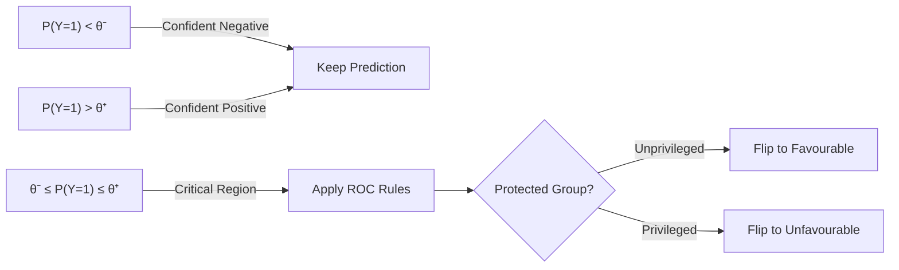

# Ch 6: Remove Bias from ML Output

## Introduction

What if you already have a **model in production** making predictions? You can't go back and retrain. Chapters 5's techniques (reweighting, ACF) require intervention before or during training. This chapter covers **post-prediction** bias mitigation.

!!! tip "When to Use Output-Level Correction"
    - Model is already in production
    - Can't retrain due to cost or complexity
    - Need a safety net even after pre-processing and in-processing treatments
    - Need model-agnostic approach that works regardless of algorithm

## Reject Option Classifier (ROC)

The ROC approach operates on the **decision boundary** — the zone where the model is least confident.

### Intuition

In binary classification, predictions near the decision boundary (P ≈ 0.5) are the least certain. The ROC says: **in this uncertain zone, flip predictions that disadvantage the unprivileged group**.

### The Decision Boundary

For a standard binary classifier:

$$f(x) = \begin{cases} 0 & \text{if } P(Y=0|X=x) \geq P(Y=1|X=x) \\ 1 & \text{otherwise} \end{cases}$$

The ROC introduces a **critical region** around the boundary:

$$\theta^- \leq P(\hat{Y}|X) \leq \theta^+$$

Where $\theta^-$ and $\theta^+$ define the uncertainty band (typically 0.5 ± some margin).

---

*Continue: [Reject Option Classifier Details →](reject-option.md)*
