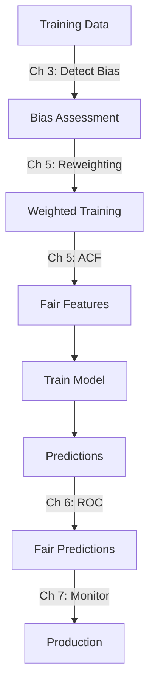

# Reject Option Classifier — Implementation

## ROC Algorithm

### Step 1: Define the Critical Region

```python
import numpy as np
import pandas as pd

def reject_option_classifier(y_proba, protected, privileged_val, 
                              theta_minus=0.4, theta_plus=0.6):
    """
    Apply Reject Option Classifier to post-hoc correct predictions.
    
    Args:
        y_proba: Predicted probabilities for positive class
        protected: Protected feature values
        privileged_val: Value identifying privileged group
        theta_minus: Lower bound of critical region
        theta_plus: Upper bound of critical region
    
    Returns:
        Corrected binary predictions
    """
    y_pred = (y_proba >= 0.5).astype(int)
    
    # Identify instances in the critical region
    in_critical = (y_proba >= theta_minus) & (y_proba <= theta_plus)
    is_privileged = protected == privileged_val
    
    # In critical region: flip unprivileged unfavourable → favourable
    flip_to_fav = in_critical & ~is_privileged & (y_pred == 0)
    y_pred[flip_to_fav] = 1
    
    # In critical region: flip privileged favourable → unfavourable
    flip_to_unfav = in_critical & is_privileged & (y_pred == 1)
    y_pred[flip_to_unfav] = 0
    
    n_flipped = flip_to_fav.sum() + flip_to_unfav.sum()
    print(f"Critical region: {in_critical.sum()} instances")
    print(f"Flipped: {n_flipped} predictions")
    print(f"  → {flip_to_fav.sum()} unprivileged flipped to favourable")
    print(f"  → {flip_to_unfav.sum()} privileged flipped to unfavourable")
    
    return y_pred
```

### Step 2: Optimize the Threshold

The critical region width ($\theta^+ - \theta^-$) controls the trade-off between fairness and accuracy:

| Wider Region | Narrower Region |
|-------------|-----------------|
| More predictions flipped | Fewer predictions flipped |
| Better fairness metrics | Less fairness improvement |
| Lower accuracy | Higher accuracy |

```python
from sklearn.metrics import accuracy_score

def optimize_roc_threshold(y_true, y_proba, protected, privileged_val,
                           margins=np.arange(0.05, 0.25, 0.02)):
    """Find optimal critical region width."""
    results = []
    
    for margin in margins:
        theta_minus = 0.5 - margin
        theta_plus = 0.5 + margin
        
        y_corrected = reject_option_classifier(
            y_proba.copy(), protected, privileged_val,
            theta_minus, theta_plus
        )
        
        acc = accuracy_score(y_true, y_corrected)
        
        # Compute SPD after correction
        priv_mask = protected == privileged_val
        spd = (
            (y_corrected[~priv_mask] == 1).mean() -
            (y_corrected[priv_mask] == 1).mean()
        )
        
        results.append({
            'margin': margin,
            'theta_minus': theta_minus,
            'theta_plus': theta_plus,
            'accuracy': acc,
            'spd': spd,
            'abs_spd': abs(spd)
        })
    
    results_df = pd.DataFrame(results)
    print(results_df.to_string(index=False))
    return results_df
```

### Step 3: Evaluate

```python
from sklearn.metrics import classification_report

# Before ROC
y_pred_before = (y_proba >= 0.5).astype(int)
print("=== Before ROC ===")
print(classification_report(y_true, y_pred_before))

# After ROC
y_pred_after = reject_option_classifier(
    y_proba.copy(), protected, 'Male', 
    theta_minus=0.4, theta_plus=0.6
)
print("=== After ROC ===")
print(classification_report(y_true, y_pred_after))
```

## ROC Properties

!!! tip "Advantages"
    - **Model-agnostic**: Works with any classifier that outputs probabilities
    - **No retraining**: Applied post-prediction
    - **Intuitive**: Only changes uncertain predictions
    - **Minimal accuracy loss**: Confident predictions are untouched

!!! warning "Limitations"
    - Only works for **binary classification** with probability outputs
    - Requires knowing the **protected feature** at prediction time
    - Can only fix bias in the **uncertainty zone** — strong biases need earlier intervention

## Complete Pipeline



---

*Back to: [Chapter 6 Overview ←](index.md)*
