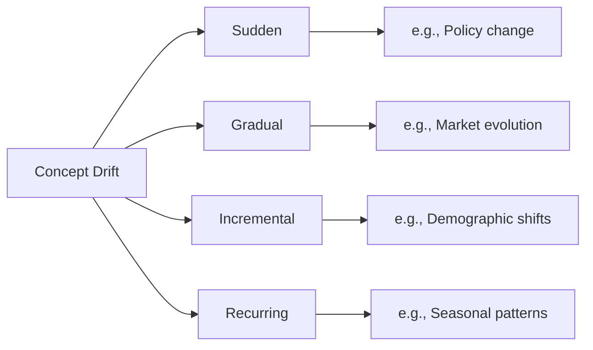

# Concept Drift

## What Is Concept Drift?

Concept drift occurs when the **relationship between features and the target** changes over time — even if the feature distributions themselves stay the same.

$$P(X|Y) \text{ changes over time}$$

!!! example
    In 2019, "employed full-time" strongly predicted loan repayment. After 2020, many full-time employees in certain industries (hospitality, travel) defaulted at higher rates. The features didn't change, but their **meaning** did.

## Types of Concept Drift



| Type | Speed | Example |
|------|-------|---------|
| **Sudden** | Instant | Regulatory change, pandemic |
| **Gradual** | Over weeks/months | Market trends, cultural shifts |
| **Incremental** | Very slow | Demographic evolution |
| **Recurring** | Periodic | Seasonal spending patterns |

## Detection Methods

### Page-Hinkley Test

Detects changes in the **mean** of a time series (sequential detection):

```python
import numpy as np

class PageHinkleyTest:
    """Online concept drift detector using Page-Hinkley test."""
    
    def __init__(self, delta=0.005, threshold=50, alpha=0.9999):
        self.delta = delta
        self.threshold = threshold
        self.alpha = alpha
        self.reset()
    
    def reset(self):
        self.n = 0
        self.sum = 0
        self.x_mean = 0
        self.m_t = 0
        self.M_t = 0
    
    def update(self, x):
        self.n += 1
        self.x_mean = self.x_mean + (x - self.x_mean) / self.n
        self.sum += x - self.x_mean - self.delta
        
        self.m_t = min(self.m_t, self.sum)
        self.M_t = self.sum - self.m_t
        
        if self.M_t > self.threshold:
            self.reset()
            return True  # Drift detected!
        return False

# Usage: monitor model error over time
detector = PageHinkleyTest(threshold=50)
for i, error in enumerate(daily_errors):
    if detector.update(error):
        print(f"⚠️ Concept drift detected at step {i}!")
```

### ADWIN (Adaptive Windowing)

ADWIN maintains a variable-length window and detects drift when the means of two sub-windows differ significantly:

```python
# Using river library
from river.drift import ADWIN

adwin = ADWIN(delta=0.002)

for i, val in enumerate(metric_stream):
    in_drift, in_warning = adwin.update(val)
    if in_drift:
        print(f"Drift detected at index {i}, window size: {adwin.width}")
```

### Monitoring Feature-Target Correlation

```python
import pandas as pd
import numpy as np

def monitor_concept_drift(data_windows, feature, target):
    """Track correlation between a feature and target over time windows."""
    correlations = []
    for window_name, window_data in data_windows.items():
        corr = window_data[feature].corr(window_data[target])
        correlations.append({'Window': window_name, 'Correlation': corr})
    
    result = pd.DataFrame(correlations)
    
    # Flag significant changes
    if len(result) > 1:
        max_change = result['Correlation'].diff().abs().max()
        if max_change > 0.1:
            print(f"⚠️ Concept drift: {feature} correlation shifted by {max_change:.3f}")
    
    return result
```

## Response Strategies

| Drift Type | Response |
|-----------|----------|
| Sudden | Immediate retrain on recent data |
| Gradual | Scheduled retrain with expanding window |
| Incremental | Sliding window retrain |
| Recurring | Season-aware models or model ensemble |

---

*Next: [Monitoring RAI →](monitoring.md)*
