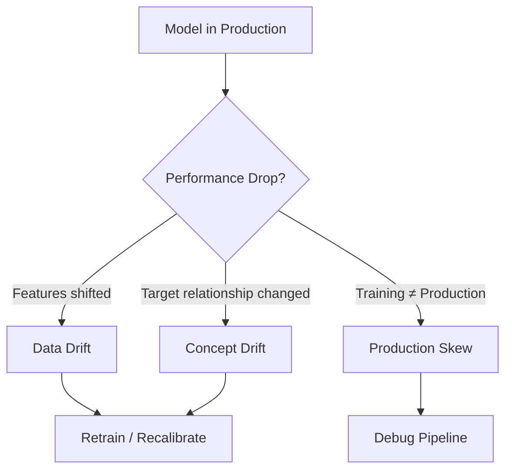

# Ch 7: Accountability in AI

## Introduction

You've built a fair, explainable model and pushed it to production. Everything looks great. Then over time, performance starts to dip — not just accuracy, but **fairness metrics too**. What happened?

The answer: **drift**. The data distribution of live data shifts over time, and if unattended, it degrades model performance on every dimension.

## Types of Degradation

| Type | What Changes | Example |
|------|-------------|---------|
| **[Data Drift](data-drift.md)** | Feature distributions ($P(X)$ or $P(Y)$) | Post-COVID income patterns shift |
| **[Concept Drift](concept-drift.md)** | Relationship between features and target ($P(X\|Y)$) | "Good credit" criteria evolve |
| **Production Skew** | Training vs live environment differences | Bugs, missing features, pipeline errors |

## Why Monitoring Matters for RAI

!!! warning "Fairness Degrades Too"
    Standard monitoring tracks accuracy. But a model that's fair at deployment can become **unfair** as demographics shift. Monitor fairness metrics alongside accuracy.

Monitoring should track:

- ✅ Overall accuracy and performance
- ⚖️ Fairness metrics (SPD, DI, equalized odds) per protected group
- 🔍 Feature importance stability (SHAP/IV drift)
- 🔒 Privacy parameters (do they need refreshing?)

## Regulatory Context

!!! note "Fed SR 11-7 Guidelines"
    The Federal Reserve recommends:
    
    - Model is being used and performing as intended
    - Monitoring is essential to evaluate whether changes necessitate adjustment, redevelopment, or replacement
    - Extension of model beyond original scope must be validated

---

*Next: [Data Drift →](data-drift.md)*
