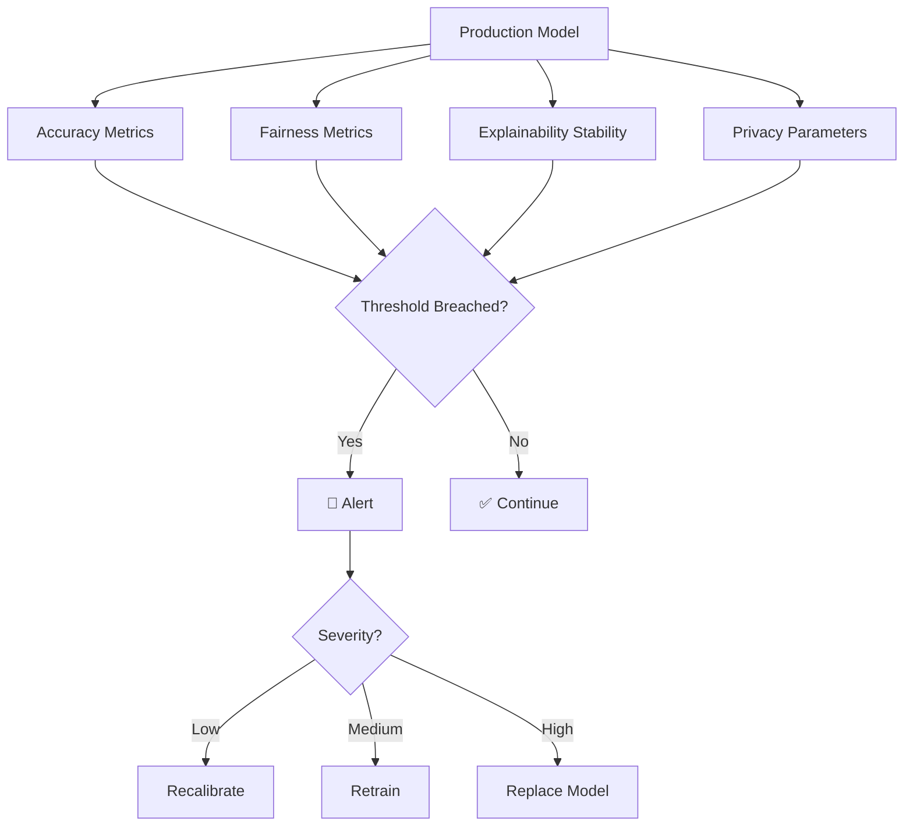

# Monitoring RAI in Production

## Beyond Accuracy Monitoring

Standard model monitoring tracks accuracy. RAI monitoring must also track **fairness, explainability, and privacy** metrics.



## What to Monitor

| Dimension | Metrics | Frequency |
|-----------|---------|-----------|
| **Accuracy** | AUC, precision, recall, F1 | Daily |
| **Fairness** | SPD, DI, equalized odds per group | Weekly |
| **Explainability** | Top-10 feature importance stability | Weekly |
| **Drift** | PSI per feature, KS tests | Daily |
| **Privacy** | Differential privacy budget ($\epsilon$) | Monthly |

## Fairness Monitoring Pipeline

```python
import pandas as pd
import numpy as np
from datetime import datetime

class RAIMonitor:
    """Production monitoring for Responsible AI metrics."""
    
    def __init__(self, protected_config, target_col, fav_val):
        self.protected_config = protected_config
        self.target_col = target_col
        self.fav_val = fav_val
        self.history = []
    
    def evaluate(self, df, y_pred, timestamp=None):
        """Compute all RAI metrics for a batch of predictions."""
        timestamp = timestamp or datetime.now()
        metrics = {'timestamp': timestamp}
        
        # Overall accuracy
        metrics['accuracy'] = (df[self.target_col].values == y_pred).mean()
        
        # Per-feature fairness
        for feat, priv_val in self.protected_config.items():
            priv_mask = df[feat] == priv_val
            
            p_fav_priv = (y_pred[priv_mask] == self.fav_val).mean()
            p_fav_unpriv = (y_pred[~priv_mask] == self.fav_val).mean()
            
            metrics[f'{feat}_spd'] = p_fav_unpriv - p_fav_priv
            metrics[f'{feat}_di'] = (
                p_fav_unpriv / p_fav_priv if p_fav_priv > 0 else np.inf
            )
        
        self.history.append(metrics)
        return metrics
    
    def check_alerts(self, spd_threshold=0.1, di_threshold=0.8):
        """Check latest metrics against thresholds."""
        latest = self.history[-1]
        alerts = []
        
        for feat in self.protected_config:
            if abs(latest[f'{feat}_spd']) > spd_threshold:
                alerts.append(f"⚠️ {feat} SPD = {latest[f'{feat}_spd']:.4f}")
            if latest[f'{feat}_di'] < di_threshold:
                alerts.append(f"⚠️ {feat} DI = {latest[f'{feat}_di']:.4f}")
        
        return alerts if alerts else ["✅ All metrics within thresholds"]
```

## Alerting Thresholds

| Metric | Green | Yellow | Red |
|--------|-------|--------|-----|
| SPD | \|SPD\| < 0.05 | 0.05–0.10 | > 0.10 |
| DI | DI > 0.9 | 0.8–0.9 | < 0.8 |
| PSI | < 0.1 | 0.1–0.2 | > 0.2 |
| Accuracy drop | < 2% | 2–5% | > 5% |

---

*Back to: [Chapter 7 Overview ←](index.md)*
