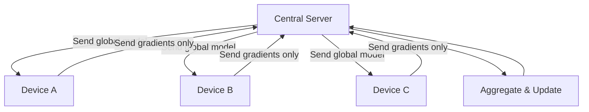

# Federated Learning

## Core Concept

Federated learning trains models **without centralizing data**. Each participant trains locally and shares only **model updates** (gradients), never raw data.



## How It Works

1. **Server** sends current global model to all participants
2. **Each participant** trains on their local data for a few epochs
3. **Each participant** sends model updates (gradients) back to server
4. **Server** aggregates updates (e.g., weighted average) into new global model
5. **Repeat** until convergence

### Federated Averaging (FedAvg)

The most common aggregation strategy:

$$w_{t+1} = \sum_{k=1}^{K} \frac{n_k}{n} w_{t+1}^k$$

Where $w_{t+1}^k$ is participant $k$'s updated model, $n_k$ is their data size, and $n$ is total data.

```python
import numpy as np

def federated_average(model_updates, data_sizes):
    """Aggregate model updates using weighted average."""
    total_data = sum(data_sizes)
    weights = [n / total_data for n in data_sizes]
    
    aggregated = {}
    for key in model_updates[0].keys():
        aggregated[key] = sum(
            w * update[key] for w, update in zip(weights, model_updates)
        )
    
    return aggregated
```

## Types of Federated Learning

| Type | Participants | Data Split | Example |
|------|-------------|-----------|---------|
| **Horizontal** | Same features, different samples | By rows | Multiple hospitals with same patient attributes |
| **Vertical** | Same samples, different features | By columns | Bank + e-commerce sharing customer models |
| **Transfer** | Different features and samples | By domain | Cross-industry knowledge sharing |

## Privacy Considerations

!!! warning "Gradients Can Leak Information"
    Even without sharing raw data, model gradients can reveal information about training data. Combine federated learning with **differential privacy** for stronger guarantees:
    
    - Add noise to gradients before sharing
    - Use secure aggregation so server only sees the sum

### Federated Learning + Differential Privacy

```python
def private_federated_update(local_model, local_data, epsilon, clip_norm=1.0):
    """Train locally with DP guarantees."""
    # Train on local data
    gradients = compute_gradients(local_model, local_data)
    
    # Clip gradients
    grad_norm = np.linalg.norm(gradients)
    if grad_norm > clip_norm:
        gradients = gradients * (clip_norm / grad_norm)
    
    # Add noise
    sensitivity = clip_norm
    noise = np.random.laplace(0, sensitivity / epsilon, gradients.shape)
    private_gradients = gradients + noise
    
    return private_gradients
```

## Real-World Applications

| Application | Why Federated? |
|------------|---------------|
| **Google Keyboard** | Improve predictions without collecting typing data |
| **Healthcare** | Train on patient data across hospitals without sharing records |
| **Finance** | Fraud detection across banks without exposing transactions |
| **IoT** | Edge devices train locally, share learnings |

---

*Back to: [Chapter 8 Overview ←](index.md)*
