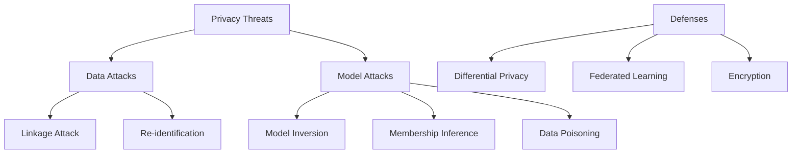

# Ch 8: Data & Model Privacy

## Introduction

In 2006, Netflix released 100 million "anonymized" movie ratings for a competition. Within **2 weeks**, researchers Narayanan and Shmatikov re-identified subscribers by cross-referencing with IMDB — uncovering viewing histories, political preferences, and sensitive personal information.

!!! danger "Anonymization Is Not Enough"
    Latanya Sweeney estimated that **87% of the US population** can be uniquely identified using just three attributes: 5-digit zip code, gender, and date of birth.

## What Is Private Data?

GDPR defines personal data as any information relating to an identifiable natural person — including:

- Social media content (text, images, videos)
- Location data from devices
- Device usage patterns and shopping behavior
- Financial information and health records
- Relationship information

## Types of Attacks

| Attack Type | Attacker Knowledge | Goal |
|------------|-------------------|------|
| **White box** | Has model parameters | Leak data, cause misclassification |
| **Black box** | No model knowledge | Reverse-engineer model or data |
| **Grey box** | Partial knowledge | Combination of above |
| **Linkage attack** | Public datasets | Re-identify anonymized records |
| **Model inversion** | Model access | Reconstruct training data |
| **Data poisoning** | Training pipeline access | Degrade model performance |

## Defense Approaches

| Technique | What It Protects | How |
|-----------|-----------------|-----|
| **[Differential Privacy](differential-privacy.md)** | Individual records | Add calibrated noise |
| **[Federated Learning](federated-learning.md)** | Raw data | Train without centralizing data |
| **k-Anonymity** | Identity | Ensure k identical records |
| **l-Diversity** | Sensitive attributes | Ensure l distinct values per group |
| **t-Closeness** | Distribution | Limit distance between distributions |

!!! tip "Privacy Early in the Pipeline"
    Add privacy protections **as early as possible** in your data pipeline. If data is made private before entering your datastore, all downstream consumption inherits the protection.

---

*Next: [Differential Privacy →](differential-privacy.md)*
