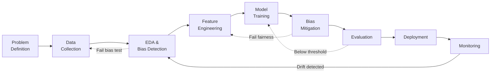

# Ch 9: Conclusion

## The Responsible AI Lifecycle

RAI should be integrated into every stage of the data science lifecycle — not bolted on after model development.

!!! tip "RAI Makes It Iterative"
    Adding RAI to the DS lifecycle creates feedback loops: failing a bias test sends you back to earlier stages. These iterations produce **more robust** models.

## The RAI Canvas

A planning tool to ensure preparedness for responsible model development:

| Card | Questions to Answer |
|------|-------------------|
| **Problem Statement** | What are we predicting? Who is affected? |
| **Owners/Approvers** | Who is accountable for RAI compliance? |
| **Algorithm** | What model type? Glass box or black box? |
| **Evaluation** | What accuracy and fairness thresholds? |
| **Fairness** | Which protected features? Which metrics? What thresholds? |
| **Explainability** | What type of explanations? For whom? |
| **Privacy** | What privacy level? What $\epsilon$ budget? |
| **Monitoring** | What drift thresholds? Alert mechanisms? |
| **Data** | Training/test split? Known biases? |

!!! note "Fair AI vs Responsible AI vs Ethical AI"
    - **Fair AI** deals with fairness — a *component* of RAI
    - **Responsible AI** encompasses fairness + explainability + accountability + privacy
    - **Ethical AI** covers even more: environmental impact, sustainability, human safety, UN SDGs
    
    RAI is the actionable engineering layer that enables ethical AI.

## Complete RAI Checklist

### Before Training
- [ ] Identify all protected features
- [ ] Determine privileged/unprivileged classes from data
- [ ] Compute SPD and DI for each protected feature
- [ ] Detect proxy features (VIF, cosine similarity, mutual information)
- [ ] Compute IV plots for feature selection
- [ ] Apply reweighting or ACF if bias detected

### During Training
- [ ] Choose appropriate model (glass box if possible)
- [ ] Apply differential privacy if needed
- [ ] Track fairness metrics alongside accuracy

### After Training
- [ ] Evaluate equalized odds, demographic parity, predictive parity
- [ ] Generate SHAP/LIME explanations
- [ ] Apply ROC if residual bias exists
- [ ] Test counterfactual fairness

### In Production
- [ ] Monitor PSI for feature drift
- [ ] Monitor fairness metrics weekly
- [ ] Set up drift detection alerts (Page-Hinkley, ADWIN)
- [ ] Track privacy budget consumption
- [ ] Schedule periodic model review

## Key Takeaways

1. **RAI is everyone's responsibility** — product owners, BAs, data scientists, engineers
2. **Start early** — consider fairness during EDA, not after deployment
3. **No single metric suffices** — use multiple fairness metrics and understand trade-offs
4. **Models degrade** — continuous monitoring is essential
5. **Privacy enables fairness** — differential privacy reduces what models learn from sensitive attributes

---

*Reference: Agarwal & Mishra, Responsible AI: Implementing Ethical and Unbiased Algorithms (Springer, 2021)*
